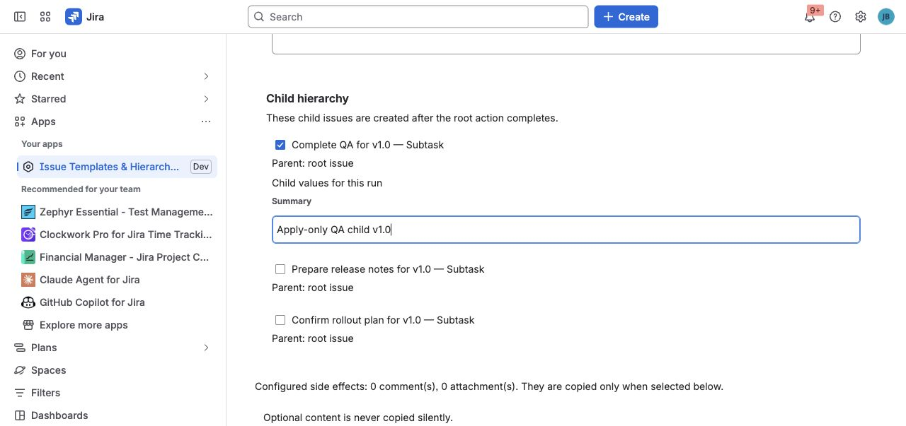
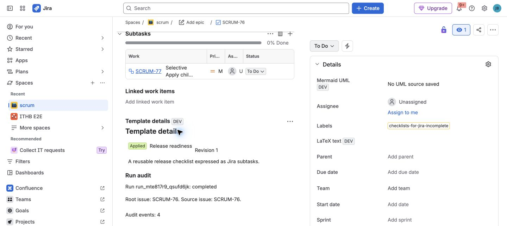

The app has three explicit user journeys. Each presents a preview before Jira
is changed.

## Create new work from a template

Use **Preview create** when the process should begin with a new root issue.

1. Choose a template from the library.
2. Answer its run variables.
3. Review and adjust the root values.
4. Select the child work needed for this run.
5. Confirm creation.

Jira receives a normal root issue followed by the selected hierarchy. The run
keeps an immutable plan, so retry can skip children that already succeeded.

## Apply a template to an existing issue

Use **Apply template** from an issue when the root already exists but needs
standard fields or follow-up work.

1. Open the issue and choose the app's Apply action.
2. Select an available template.
3. Compare the current value with the template value.
4. Select only the root fields and child work you want.
5. Include configured comments or attachments only when needed.
6. Confirm Apply.

The default **only empty** policy preserves a populated Jira field. The preview
makes every selected overwrite visible before it happens.

## Recreate live work once

Use **Recreate issue and selected work** when a useful live issue should be
reproduced without adding a governed template to the library.

Choose the destination project and issue type, select the supported root
fields, children, and links, then review the one-time creation plan. The
resulting issue is marked **Recreated once** in its provenance.

## Understand the result

The **Template details** issue panel shows:

- Operation type, template name, and template revision.
- Root and source issue.
- Durable run ID and current status.
- One outcome for each child node.
- The latest actionable error for a partial run.

Retry is available only for failed or partial work. Completed nodes are not
replayed.

