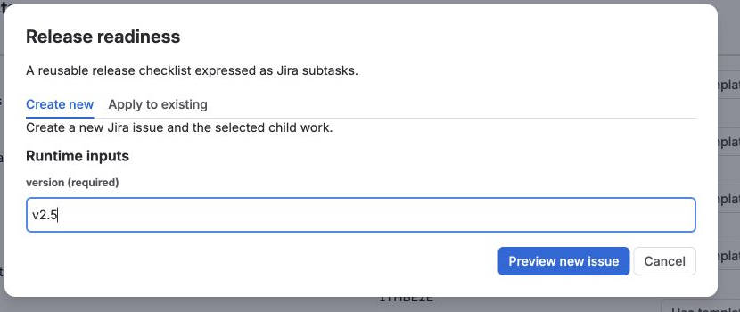
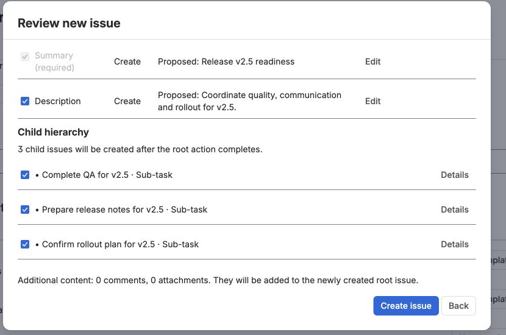
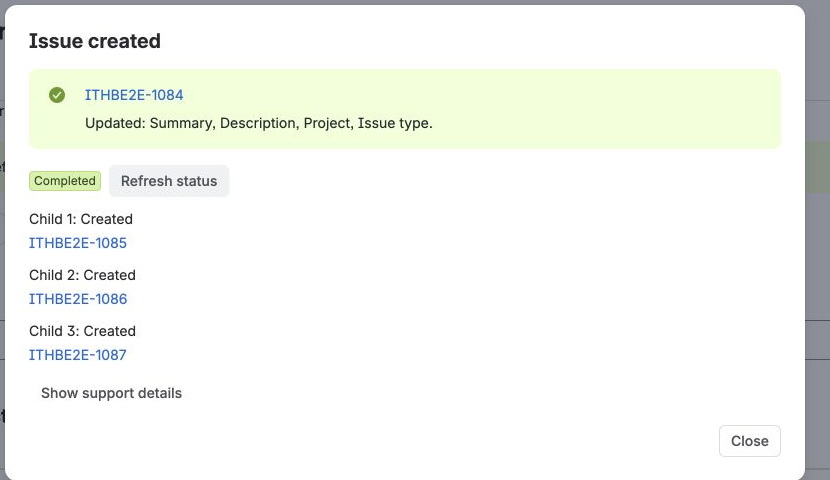
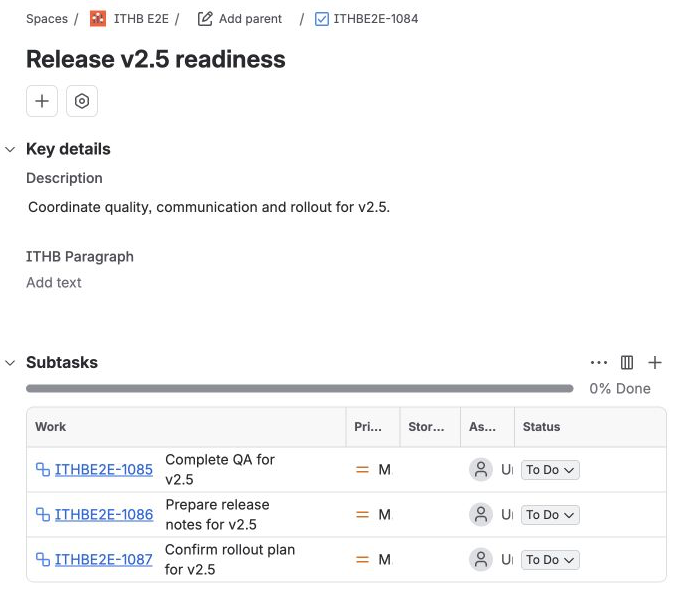

## Goal

Create **one Jira root issue and one or more child work items** from a starter
template.

You only need to complete three steps.

## Before you begin

You need:

- the app installed with an active evaluation or subscription;
- permission to create Jira issues in the target project;
- a Jira administrator for the one-time starter installation.

## 1. Install the starters

1. Open **Jira settings → Issue Templates & Hierarchy Builder**.
2. Open **Administration → Defaults & integrations**.
3. Select **Install editable starters**.
4. Enter an issue key from the project you want to use.
5. Confirm **Install editable starters**.

You now have editable examples such as **Release readiness**. This starter asks
for one value, `version`, and defines three child work items.

Before its first run, open **Release readiness → Details → Edit template →
Structure**. Confirm that each child uses the actual subtask work type in your
Jira project and has **Root issue** as its parent, then save the template. Jira
sites can name that work type differently; on the example site it is
**Sub-task**. If Preview reports that hierarchy metadata is unavailable, correct
the work type here before creating an issue.

## 2. Preview Release readiness

1. Go back to **Templates**.
2. Select **Use template** beside **Release readiness**.
3. Keep **Create new** selected and enter a version, for example `v2.5`.
4. Select **Preview new issue**.

The review resolves the root Summary and Description and shows the three
selected subtasks before any Jira work is created.

Check only two things:

- the root values look right;
- the child work you want is selected.

Nothing has been created yet.

## 3. Create and verify

Select **Create issue**.

Open the new Jira issue and confirm the selected child work was created.

The run may briefly show **Pending** or **Running** while child work is
processed. Select **Refresh status** until the run reaches **Completed**.

The Jira root has the resolved description and all three subtasks.

Open **Template details** on that issue to confirm the template revision and
run status.

Success looks like this:

- the root issue exists;
- the selected child work exists;
- the run shows **Completed**.

That's it — you have completed the core product flow.

## What do you want to do next?

| Next goal | Guide |
| --- | --- |
| See how other teams could use the app | [Explore Use Cases](../use-cases/) |
| Change the starter or build your own template | [Templates and Supported Fields](../templates-and-fields/) |
| Apply a template to an existing Jira issue | [Create, Apply, and Recreate](../create-apply-recreate/#apply-a-template-to-an-existing-issue) |
| Ask for values that change every run | [Variables and Smart Values](../variables-and-smart-values/) |
| Let JSM customers choose templates | [JSM Customer Portal Templates](../jsm-customer-portal/) |
| Run templates from Jira workflow transitions | [Workflow Create](../workflow-create/) |

If the result does not match Preview, open
[Troubleshooting and Support](../troubleshooting-and-support/).
