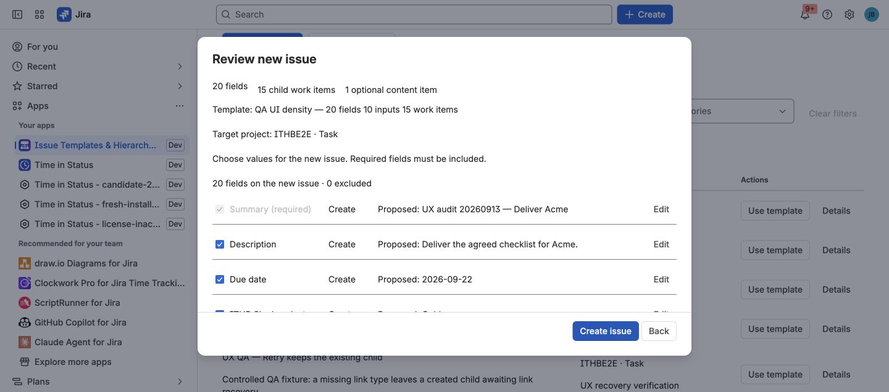

This guide takes you from installation to the first issue hierarchy created
from a reusable template. You do not need to understand Forge or edit JSON.

## Before you begin

You need:

- A Jira Cloud site with the app installed and an active evaluation or
  subscription.
- Permission to create issues in the target project.
- A Jira or project administrator to install starters or manage governed
  templates.

## Open the template library

1. In Jira, open **Apps**.
2. Select **Issue Templates & Hierarchy Builder**.
3. Enter an issue key from the project you want to use for the starter data.
4. Select **Install editable starter templates**.

The starter gallery contains normal editable templates for a bug report, user
story, teammate onboarding, and release readiness. They are starting points,
not locked demo content.

## Review a template

Open **Release readiness** and select **Edit**. Review:

- The Jira project and root issue type.
- Root fields owned by the template.
- The three child tasks and their parent relationships.
- Any variables that users answer for each run, plus supported Smart Values
  such as `{{today+7d}}` or `{{project.key}}`.
- Availability rules and default behavior.

Save only when the project, issue type, and fields match your Jira
configuration. See [Templates and supported fields](../templates-and-fields/)
for the complete field list.

## Preview and create

1. Select **Preview create** on the template.
2. Answer any required variables.
3. Review the resolved root fields, especially dates and Jira-context values.
4. Change a run-specific value if needed.
5. Deselect any child work that is not required this time.
6. Select the final Create action.

The root issue is created first. Child work is then processed from a durable
run plan. If a child fails, completed items are retained and a retry does not
create them again.

Variables are questions answered by the user. Smart Values are bounded values
resolved by the app from the run time or Jira context. They are not the Jira
Automation expression language. See [Variables and Smart Values](../variables-and-smart-values/)
for the exact token list and availability rules.

## Confirm the result

Open the new root issue and check:

- The expected fields and subtasks are visible in Jira.
- **Template details** shows the template name and revision.
- The run status is completed, or each partial result explains what needs
  attention.

Next, learn how to [Apply or Recreate work](../create-apply-recreate/) and how
to [configure availability](../administration/).
