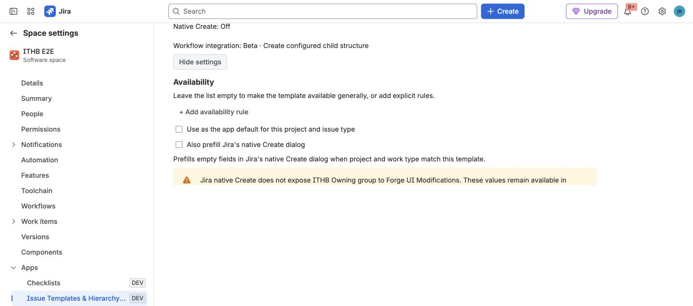

Native Create prefill is an optional convenience for teams that want selected
template values in Jira's standard **Create** dialog. It is not required for
the app's explicit Create and Apply workflows.

Native Create does not show the app's run-variable form or resolve a fresh Jira
context for every dialog. When an administrator saves the rule, the app
snapshots literal template values and available variable defaults into the UI
Modification. Use explicit Create when users must answer variables or when a
date/context value must be calculated for each run.

## How a rule works

An administrator enables prefill for one exact combination of:

- Jira project.
- Issue type.
- Global Issue Create context.

The app then fills supported fields only when both project and issue type
match. Changing context causes app-owned values to be reevaluated.

## Enable a rule

1. Open a template and select **Edit template**.
2. Continue to **Review & settings** and expand the settings.
3. Enable **Use as the app default for this project and issue type**.
4. Enable **Also prefill Jira's native Create dialog**.
5. Select **Save template**.
6. Open Jira's standard **Create** dialog and test the exact project and work
   type before rolling the rule out.

## User-value protection

The rule follows two safety principles:

1. Fill an empty field only.
2. Clear a value on context change only while that value is still owned by the
   app.

If a user edits the prefilled value, the app treats it as user-owned and does
not remove it during a later context change.

## Supported fields in native Create

Forge UI Modifications exposes a smaller field set than the app's explicit
workflows. The verified native path supports common system fields plus the
app's URL and cascading-select handling where Jira exposes them.

Group picker and Sprint are not exposed to this Forge integration, so this app
does not prefill those fields through native Create. They remain available in
explicit Create and Apply.

## Variables and Smart Values

- Every required template variable needs a valid default before the native
  rule can be saved.
- Native Create cannot ask the user for a template variable. It uses the
  default that was snapshotted when the administrator saved the rule.
- Do not use `{{today}}`, `{{now}}`, or relative-date tokens for a date that
  should move with each dialog opening. The saved rule contains the value
  resolved at configuration time.
- Issue, root, parent, and current-user context tokens are not a dependable
  native-prefill path. Use [explicit Create](../create-apply-recreate/) and
  confirm the resolved preview instead.

## Platform boundary

Jira currently allows up to five UI Modifications apps to apply changes in the
same project, issue-type, and view context. They run asynchronously, and apps
that modify the same field can conflict; when more than five are configured,
some app changes are ignored.

Atlassian may also change which fields a Jira Create surface exposes. Keep
explicit Create as the dependable cross-context path and verify a new rule in
its exact project and issue type before announcing it to users.
