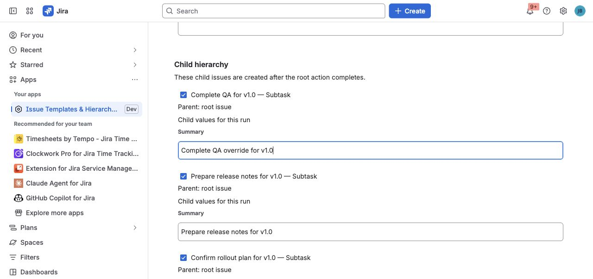

Create repeatable Jira work without rebuilding the same issues and subtasks every
time.

**New to the app? Start here:**

1. Install the editable starters.
2. Open **Release readiness** and select **Use template**.
3. Preview the hierarchy, then select **Create issue**.

[Start the quick-start guide →](../getting-started/)

## Pick the workflow you need

| I want to… | Use |
| --- | --- |
| Create new work from a saved process | [Create](../create-apply-recreate/#create-new-work-from-a-template) |
| Add standard fields or follow-up work to an existing issue | [Apply](../create-apply-recreate/#apply-a-template-to-an-existing-issue) |
| Copy useful live Jira work once | [Recreate](../create-apply-recreate/#recreate-live-work-once) |
| Let a JSM customer choose a template | [JSM portal templates](../jsm-customer-portal/) |
| Run automatically after a Jira transition | [Workflow Create](../workflow-create/) |

If you are unsure, start with **Create** or **Apply**. Both show a preview before
Jira is changed.

## What the app protects

- **Preview first.** Review fields and hierarchy before the final action.
- **Preserve user input.** Apply and automatic flows avoid silent unrelated
  overwrites.
- **Retry safely.** Partial hierarchy runs reuse completed work instead of
  creating duplicates.

## See what teams can build

| Recurring job | Example |
| --- | --- |
| Release work | [Release readiness checklist](../use-case-release-readiness/) |
| New people | [Employee onboarding](../use-case-employee-onboarding/) |
| Customer delivery | [Customer onboarding](../use-case-customer-onboarding/) |
| Existing incidents | [Incident follow-up](../use-case-incident-follow-up/) |
| Service requests | [JSM request fulfillment](../use-case-jsm-request-fulfillment/) |

[Explore more ideas →](../use-cases/)

## Go deeper when you need it

- [Build and edit templates](../templates-and-fields/)
- [Variables and Smart Values](../variables-and-smart-values/)
- [Administration and availability](../administration/)
- [Frequently Asked Questions](../faq/)
- [Troubleshooting and Support](../troubleshooting-and-support/)
