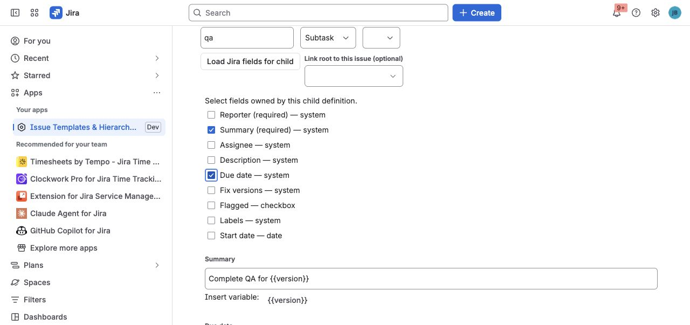

A template describes one root issue and an optional bounded hierarchy of
subtasks or linked issues. It also records the Jira context, variables,
availability rules, overwrite policy, and revision used for support and
provenance.

## Create a template from scratch

1. Open the template library and select **Create template**.
2. Give the template a clear name, description, and category.
3. Choose the target Jira project and issue type.
4. Load the Jira fields available in that context.
5. Select only the fields the template should own and enter their values.
6. Add child definitions and load fields separately for each child issue type.
7. Add variables or availability rules when needed.
8. Save the template.

The app stores stable Jira field IDs and compact schema information. Field
names remain readable labels and can change without becoming the field's
identity.

## Capture an existing issue

Use **Create template from issue** when a live issue already represents the
process you want to reuse.

The capture preview lists supported root fields and native subtasks. Choose the
fields and child work to keep before saving. Unsupported fields are reported
and omitted rather than copied with a guessed payload.

## Supported Jira-native fields

The documented product paths support:

- Short text and paragraph fields.
- URL and number fields.
- Date and date-time fields.
- Single select, multi-select, cascading select, and checkbox fields.
- Single-user and multi-user pickers.
- Group and multi-group pickers.
- Sprint fields on supported Jira Software contexts.
- Common system fields such as Summary, Description, Assignee, Reporter,
  Priority, Labels, Components, Fix versions, Due date, and Environment when
  Jira exposes them as writable in the selected context.

For Sprint, the app discovers active and future Sprints from visible Scrum
boards. Jira rejects a direct Sprint assignment to a subtask, so subtasks
inherit Sprint membership from their parent instead.

## Context changes

A field can be removed, renamed, or leave the target project/issue-type
context. Before writing, the app reloads the live Jira metadata. An unavailable
field is warned and skipped; it does not silently invalidate the whole
hierarchy.

See [Known limitations](../known-limitations/) for Rank, Assets, third-party
fields, and native Create-specific boundaries.

