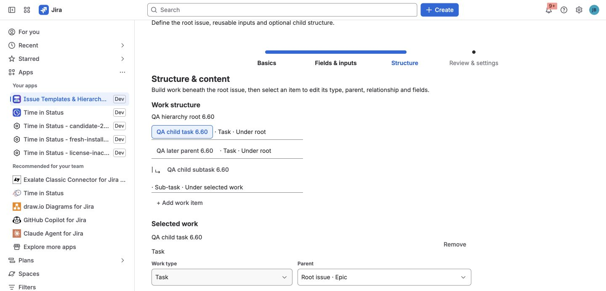

A template describes one root issue and optional child work. Each work item can
have a Jira parent, an additional issue link, both, or neither when Jira allows
that structure. The template also records the Jira context, variables,
availability rules, overwrite policy, and revision used for support and
provenance.

## Create a template from scratch

1. Open the template library and select **Create template**.
2. In **Basics**, give the template a clear name, description, category,
   project, and work type.
3. In **Fields & inputs**, add only the Jira values the template should own and
   define any runtime inputs.
4. In **Structure**, add child work and configure each item's work type,
   parent, optional issue link, and Jira values.
5. In **Review & settings**, confirm the outcome, overwrite rule, availability,
   and optional integrations.
6. Select **Save template**.

The app stores stable Jira field IDs and compact schema information. Field
names remain readable labels and can change without becoming the field's
identity.

## Build the work structure

Open **Structure** in the template editor, add a work item, and choose its work
type. Configure its two relationships separately:

- **Parent** controls Jira hierarchy. Choose the root issue, a compatible work
  item in the template, or **Standalone — no Jira parent** when that work type
  can exist without a parent.
- **Relationship** optionally adds a Jira issue link. Choose the link type and
  direction shown by the editor, or keep **Hierarchy only**.

The parent list follows the hierarchy levels configured by Jira. It excludes
self, descendants, same-level work and other incompatible choices that would
produce an invalid Jira hierarchy. A compatible work item added later in the
template can still be selected as the parent.

Review the visible tree after changing a work type or parent. If the new work
type makes an existing parent invalid, the app clears that choice instead of
guessing a replacement.

A template can contain up to 20 child work items. This is also the maximum
number of related work items inspected by a single Capture or Recreate operation.

## Add reusable and dynamic values

Use the **Insert variable** controls beside compatible root and child text
values to add tokens such as `{{version}}`. Date fields also provide shortcuts
for **Today**, **In 7 days**, and **In 1 month**.

Typed Jira fields should normally keep their typed editor. For example, choose
a user with Jira's User picker and choose a Sprint from the discovered Sprint
options. Do not place a text token into a Jira option ID unless that exact path
has been verified in Preview.

Read [Variables and Smart Values](../variables-and-smart-values/) before using
context tokens such as `{{issue.key}}` or `{{parent.key}}`; some Jira values do
not exist until a particular operation or child creation step.

## Capture an existing issue

Use **Create from issue** in the library, or **Create template from issue** from
an issue's actions menu, when live Jira work already represents the process you
want to reuse.

The capture preview lists supported root fields, nested child work, and links to
the captured root. Select **Preview capture**, choose the fields and related
work to keep, and then select **Save template**. If
the same issue is both below the root and linked to it, the app keeps one work
item with both relationships instead of duplicating it. Unsupported fields are
reported and omitted rather than copied with a guessed payload.

## Supported Jira-native fields

The documented product paths support:

- Short text and paragraph fields.
- URL and number fields.
- Date and date-time fields.
- Single select, multi-select, cascading select, and checkbox fields.
- Single-user and multi-user pickers.
- Group and multi-group pickers.
- Sprint fields on supported Jira Software contexts.
- Common system fields such as Summary, Description, Assignee, Reporter,
  Priority, Labels, Components, Fix versions, Due date, and Environment when
  Jira exposes them as writable in the selected context.

For Sprint, the app discovers active and future Sprints from visible Scrum
boards. Jira rejects a direct Sprint assignment to a subtask, so subtasks
inherit Sprint membership from their parent instead.

## Context changes

A field can be removed, renamed, or leave the target project/issue-type
context. Before writing, the app reloads the live Jira metadata. An unavailable
field is warned and skipped; it does not silently invalidate the whole
hierarchy.

When Apply or Recreate targets another project, the app maps work types by name
and subtask kind, then validates their hierarchy levels before changing Jira.
If the destination cannot represent the selected structure, the preview stops
the operation and identifies the incompatible work item.

See [Known limitations](../known-limitations/) for Rank, Assets, third-party
fields, and native Create-specific boundaries.
