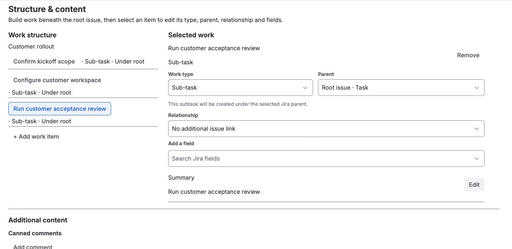

**Use this when:** customer implementations follow similar delivery stages.

## Example

```text
Customer rollout — {{customer}}
├─ Confirm onboarding requirements
├─ Configure customer environment
├─ Validate integration or data
├─ Prepare user handoff
└─ Verify go-live
```

Change each run:

`customer` · `targetDate` · `deliveryOwner` · `environment`

## Best fit

**Create from a template**



*This saved three-child fixture illustrates how to configure hierarchy. The
expanded five-step example and customer-specific variables above are possible
customizations; they are not shown in this image.*

### What this gives the team

- A standard implementation plan without cloning a whole Jira project.
- Customer-specific values and optional child work per rollout.
- Destination hierarchy validation before Jira is changed.

Use **Recreate** when an existing rollout is useful once but should not become a
governed reusable template.

## Also works for

Professional services · partner enablement · migration project preparation · managed-service
onboarding · new-site rollouts.

[Choose Create vs Recreate →](../create-apply-recreate/)  
[Build the hierarchy →](../templates-and-fields/)
