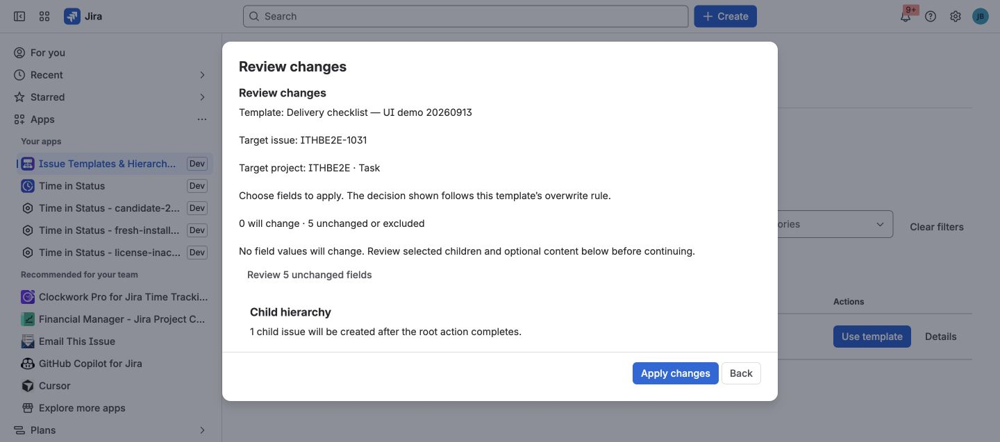

**Use this when:** the incident already exists, but follow-up work repeats.

## Example

```text
INC-123 — Checkout outage
├─ Complete root-cause analysis
├─ Review alerting gaps
├─ Define corrective actions
└─ Prepare incident retrospective
```

## Best fit

**Apply to the existing incident**



*This verified Apply preview shows no root-field changes and one selected child.
That is the pattern to use when the incident details should stay untouched.*

### What this gives the team

- The existing incident remains the source of truth.
- Standard follow-up work is added only after review.
- Partial child creation can resume from the same run.

Preview **Current** vs **Proposed**, keep the real incident details, and add only
the follow-up work you need.

## Also works for

Security events · failed deployments · customer escalations · defect reviews ·
operational exceptions.

[Build the follow-up template →](../templates-and-fields/)  
[Use Apply →](../create-apply-recreate/#apply-a-template-to-an-existing-issue)
