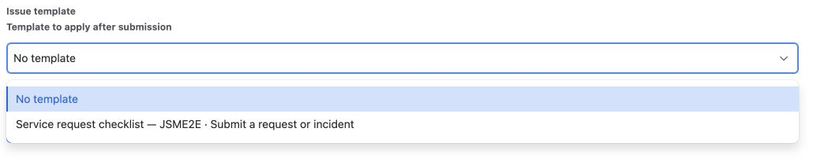
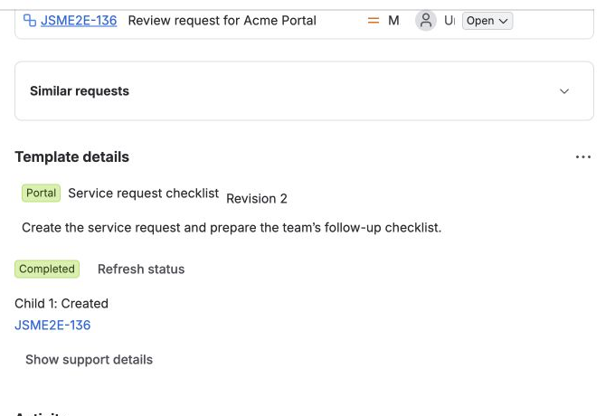

**Use this when:** customers submit a simple request, but agents need repeatable
internal follow-up work.

## Example you can build

```text
Customer request:
Provision test environment for Project Atlas

Internal follow-up:
├─ Validate request details
├─ Prepare environment
├─ Perform configuration
└─ Verify fulfillment
```

## Best fit

**JSM Customer Portal Templates**

Production 4.0.0 verified that an authenticated portal-only customer sees
**No template** plus only the exact matching friendly template for the request
context. Anonymous portal access is not supported.



The verified request was **Access request for Acme Portal**. Its smaller
**Service request checklist** template created one internal follow-up child.



*These images show the actual one-child fixture. The four-step Project Atlas
outline above is an example of how the same workflow could be expanded.*

### What this gives the team

- A simple customer-facing request experience.
- Consistent internal follow-up work behind the request.
- A supportable run record for agents without exposing internal template data to
  the customer.

The customer sees **No template** plus matching choices for the exact request
type. Their populated Summary and Description stay unchanged.

## Good for

Provisioning · access/setup requests · onboarding requests · standard operational
changes · internal service fulfillment.

[Configure the JSM flow →](../jsm-customer-portal/)  
[Build the reusable template →](../templates-and-fields/)
