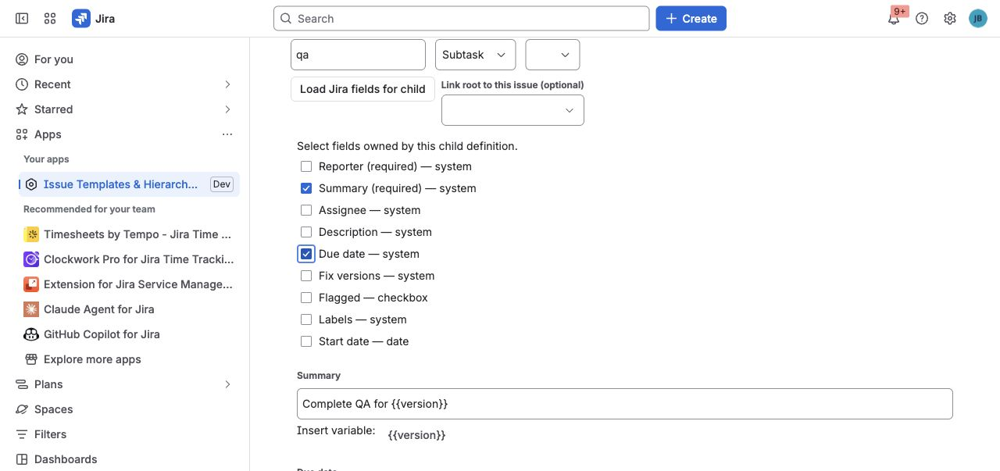
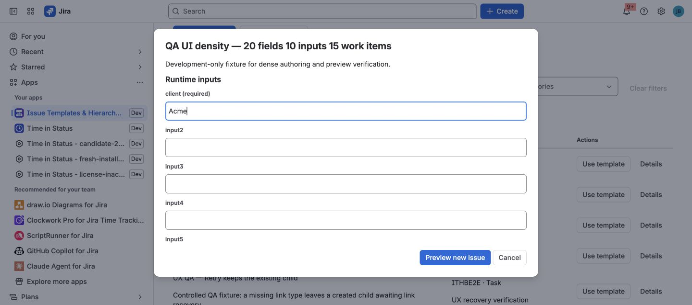

Variables and Smart Values let one template adapt to each run without turning
it into an unrestricted script.

- A **variable** is a question defined by the template author. The user answers
  it before previewing the run, for example `{{version}}` or `{{customer}}`.
- A **Smart Value** is a value supplied by the app from the run time or Jira
  context, for example `{{today+7d}}` or `{{project.key}}`.

This is a bounded Issue Templates syntax. It is not the Jira Automation Smart
Values language and does not evaluate arbitrary expressions, functions, or
scripts.

## Start with a complete example

Suppose a release template contains:

```text
Root summary: Release {{version}} for {{project.key}}
Due date: {{today+7d}}
Child summary: Prepare release notes for {{version}}
```

The author defines a required text variable named `version`. At run time the
user enters `3.2.0`. If the recorded run date is 3 September 2026 and the
destination project is `PAY`, the preview can show:

```text
Root summary: Release 3.2.0 for PAY
Due date: 2026-09-10
Child summary: Prepare release notes for 3.2.0
```

The exact date is calculated from the single recorded run time. Always review
the resolved preview before selecting the final Create or Apply action.

## Define a variable

1. Open **Apps → Issue Templates & Hierarchy Builder**.
2. Create a template or select **Edit** on an existing template.
3. Under **Variables**, select **Add variable**.
4. Enter a unique name, choose a type, and optionally add a default.
5. Enable **Required** when every run must supply a value.
6. Insert the generated `{{name}}` token into a supported root or child value.
7. Save the template, enter a test value, and use Preview before creating Jira
   work.



## Variable types

| Type | What the user enters | Good use |
| --- | --- | --- |
| Text | A short text value | Version, customer, environment, or readable owner name |
| Select | One option defined by the author | Tier, region, release channel, or process variant |
| User | A Jira user selected with Jira's picker | Assignee, Reporter, or a user-picker custom field |
| Date | A date in Jira's date control | Start date, Due date, or a date custom field |

Select variables require at least one option. Date variables use `YYYY-MM-DD`
internally. User variables store an Atlassian account ID and are intended for
user fields; use a separate text variable when a person's readable name must
appear in a Summary or Description.

Variable names must start with a letter or underscore. The remaining
characters can be letters, numbers, dots, dashes, or underscores. Names are
case-sensitive and must be unique within the template.



## Where tokens can be used

The supported authoring paths are:

- Text, paragraph, and common system values on the root issue.
- Equivalent supported values on child issues.
- Jira date fields through the **Today**, **In 7 days**, and **In 1 month**
  shortcuts, or another supported date token entered directly.
- Canned-comment text.

Optional native Jira Create prefill is different: it snapshots literal values
and variable defaults when an administrator saves the rule. It does not ask
run variables or calculate fresh context and relative dates each time Jira's
Create dialog opens. See [Native Jira Create Prefill](../native-create-prefill/).

The editor shows an **Insert variable** action beside compatible text values.
For a typed Jira field such as Select, Group, Sprint, or User, prefer that
field's Jira-aware control instead of placing a token into an option ID.

## Built-in Smart Value reference

| Token | Resolved value | Important availability note |
| --- | --- | --- |
| `{{today}}` | Run date as `YYYY-MM-DD` | Available wherever tokens are resolved |
| `{{now}}` | Recorded run time as an ISO timestamp | Available wherever tokens are resolved |
| `{{project.key}}` | Destination project key | Available after the destination context is known |
| `{{issue.key}}` | Current issue key | Available for an existing-issue flow; a new root has no key before creation |
| `{{source.key}}` | Source issue key, or current issue key when applicable | Requires an existing source/current issue |
| `{{root.key}}` | Root issue key | Known for Apply and during child execution; not known in a new root field |
| `{{parent.key}}` | Created parent issue key | Available during child execution after the parent exists; not available in the initial preview |
| `{{issue.summary}}` | Current issue Summary | Requires a loaded existing issue context |
| `{{issue.type}}` | Jira issue-type identifier | This is an identifier, not the issue-type display name |
| `{{currentUser.accountId}}` | Signed-in Atlassian account ID | Use a User variable and Jira user field for normal authoring |
| `{{currentUser.displayName}}` | Signed-in user's display name | Currently safe only for explicit Create root values and its root comments; do not rely on it in Apply or child values |

Context values exist only when the selected workflow knows them. For example,
`{{parent.key}}` cannot be shown before the parent issue has been created. If a
readable value must be identical across Create, Apply, preview, and child work,
collect it as a required text variable instead of depending on a late Jira
context.

### Relative date and time syntax

Use `today` for a date or `now` for a timestamp, followed by an optional plus or
minus offset:

```text
{{today+7d}}
{{today-2w}}
{{today+1m}}
{{now+4h}}
{{now-1d}}
```

| Unit | Meaning |
| --- | --- |
| `h` | Hours |
| `d` | Days |
| `w` | Weeks |
| `m` | Months |
| `y` | Years |

The amount must be a positive whole number; the sign controls the direction.
Resolution uses one UTC run timestamp so the root and children do not drift if
processing crosses midnight. Review month-end and year-end dates in Preview.

## Resolution and validation rules

- A missing required variable blocks Preview and mutation.
- An invalid date or Select answer produces an inline error.
- User answers come from Jira's picker; users do not type account IDs.
- Custom variables take precedence over built-in Smart Values. Avoid defining
  variables named `today`, `now`, `project.key`, or any other built-in token.
- An unknown token, a misspelled token, or a token whose context is unavailable
  resolves to an empty string. The app does not execute it as code.
- The initial preview is the safety boundary: verify every resolved field and
  selected child before confirming the operation.

If a result is blank or unexpected, first check the token spelling and the
workflow context. See [Troubleshooting and Support](../troubleshooting-and-support/)
when the preview and final Jira result do not agree.
