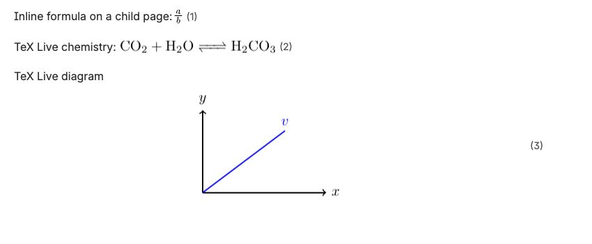

Use an Advanced LaTeX macro when your content requires a full LaTeX document or packages unavailable in the everyday MathJax editor.

## Create an advanced formula

1. Edit a Confluence page.
2. Insert **Advanced LaTeX — inline** or **Advanced LaTeX — display**.
3. Enter a complete LaTeX document in **LaTeX source**.
4. Select **Preview**.
5. Correct any reported LaTeX error, then select **Save**.
6. Publish or update the page.

Use this minimal document structure to avoid page headers, footers, and page numbers in the rendered image:

```latex
\documentclass{article}
\pagestyle{empty}
\begin{document}
Your content here
\end{document}
```

## Plot example

```latex
\documentclass{article}
\pagestyle{empty}
\usepackage{pgfplots}
\begin{document}
\begin{tikzpicture}
\begin{axis}
\addplot3[surf]{exp(-x^2-y^2)*x};
\end{axis}
\end{tikzpicture}
\end{document}
```

## Chemistry example

```latex
\documentclass{article}
\pagestyle{empty}
\usepackage{chemfig}
\begin{document}
\chemfig{A*5(-B=C-D-E=)}
\end{document}
```



Published output keeps inline MathJax, TeX Live chemistry, and TeX Live diagrams readable alongside ordinary Confluence content.

Advanced rendering uses an Atlassian-hosted Forge Container. The first uncached preview can take longer while a non-production container starts; production keeps one renderer instance available. Published output is cached as a derived PNG, so ordinary views do not compile unchanged content every time.

TeX Live output is a raster image with its authored colors and canvas. Unlike ordinary MathJax SVG output, it is not recolored when Confluence changes between Light and Dark appearance.
