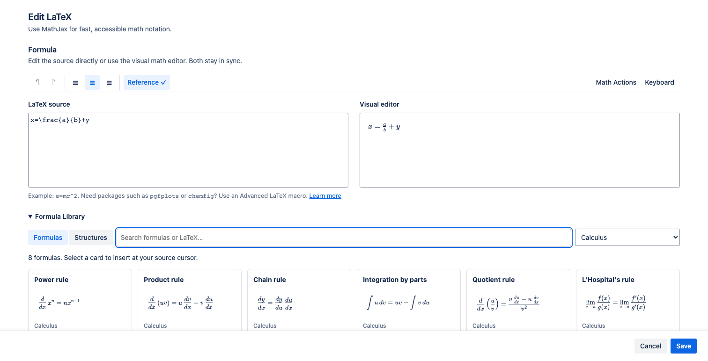

Formula Library helps you start with correct, editable LaTeX instead of writing every expression from scratch. It is available in the two MathJax macros.

## Insert a formula

1. Open a **LaTeX Math — inline** or **LaTeX Math — display** macro.
2. Put the source cursor where the formula should be inserted. Select source text first if you want to replace it.
3. Expand **Formula Library**.
4. Keep **Formulas** selected, search by name or LaTeX command, and optionally choose a category.
5. Select a formula card.
6. Edit its variables in **LaTeX source** or **Visual editor**.

Insertion copies the formula into this macro. Later edits do not change the library or other formulas created from the same card.

## Formula categories

The library contains 44 ready-made formulas:

| Category | Examples |
| --- | --- |
| Algebra | Quadratic formula, binomial theorem, logarithm product rule |
| Geometry | Circle and triangle areas, Pythagorean theorem, distance and slope |
| Calculus | Power, product, chain, and quotient rules; integration by parts |
| Trigonometry | Laws of sines and cosines, double-angle and half-angle identities |
| Statistics | Normal distribution, Bayes theorem, mean |
| Physics | Mass-energy equivalence, Newton's second law, gravitation, Ohm's law |

Search matches names, categories, keywords, and meaningful LaTeX commands.

## Formulas versus Structures

Select **Structures** for one of 11 reusable building blocks: fraction, square root, matrix, definite integral, derivative, limit, partial derivative, aligned equations, piecewise function, SI units, or Greek symbols.

Use **Formulas** for a complete named rule or relationship. Use **Structures**, **Math Actions**, or the virtual keyboard when you are constructing your own expression.

If the library shows no results, clear both the search text and category filter. Formula Library is not a shared library for formulas saved by your team.

