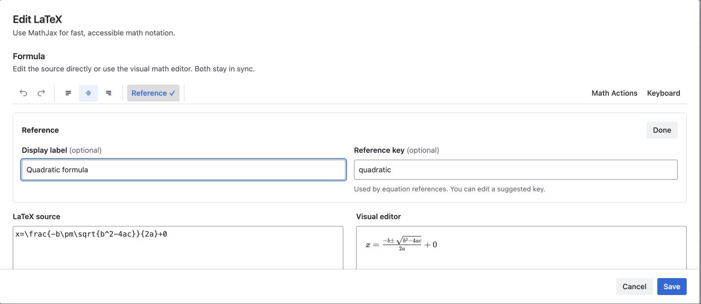
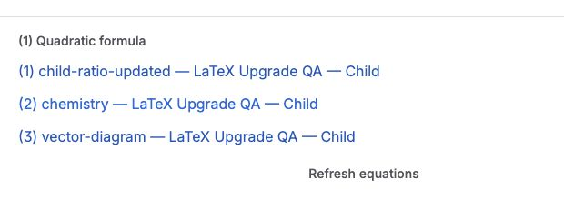

A referenceable formula has two independent values:

- **Display label** is the optional reader-friendly name shown in equation pickers and lists.
- **Reference key** is the identifier used by reference macros. It is not shown as a caption beside the formula.

## Make a formula referenceable

1. Open a MathJax formula and select **Reference** in the toolbar. For an Advanced LaTeX formula, use its Options section.
2. In MathJax, enter a **Display label**, such as `Energy equation`, and enter or review the **Reference key**, such as `energy-equation`.
3. In Advanced LaTeX, the equivalent fields are named **Display name** and **Reference name**.
4. Select **Done** if shown, then **Save**.
5. Publish or update the Confluence page.

For a new MathJax formula, the app can suggest an editable key from the display label. After a key exists, changing the display label does not silently change it or break existing links.

Keep Reference keys unique within a page. If duplicate or normalized-equivalent keys exist, numbering and navigation use the first matching formula.

## Link to an equation

1. Edit the page where the link should appear.
2. Insert **LaTeX reference**.
3. Choose **This page** or **Another page**.
4. For another page, search for and select the Confluence page.
5. Choose the target from **Equation**. Each option shows the equation number, display label when available, and Reference key.
6. Select **Save**, then publish the page.

Cross-page references save the selected page ID, so the link continues to target that page after a title change or move. **Advanced: enter a legacy key** is a fallback for existing configurations that cannot be selected from published content; it is not the normal setup flow.

Selecting a reference on a published page moves to the matching formula. References in the Confluence editor are previews and do not navigate.

## Create an equation list

1. Insert **LaTeX equation list**.
2. Choose **This page** or **Another page**. Search for the page if needed.
3. Enable **Include child pages** to include published descendant pages.
4. Keep **Show names** enabled to show each display label, falling back to the Reference key.
5. Select **Save**, then publish the page.

The list preserves each source page's equation numbering; it does not create one new sequence across several pages. Cross-page entries also identify their source page.

This example combines a same-page reference with an equation list that identifies equations from the current page and a child page. Select an equation number or list entry to move to that formula.

## Refresh after changes

The picker and list read published content. After adding, removing, reordering, or renaming a referenceable formula:

1. Publish the source page.
2. Reload the page containing the reference or select **Refresh equations** on the equation list.

An already open page does not subscribe to changes in another browser tab. Historical page versions show formula images but do not provide historical reference numbers, navigation, or reconstructed equation lists.

## Access rules

References and lists use the current reader's Confluence permissions. They do not reveal equations from a restricted page. Readers with different access can therefore see different list results.
