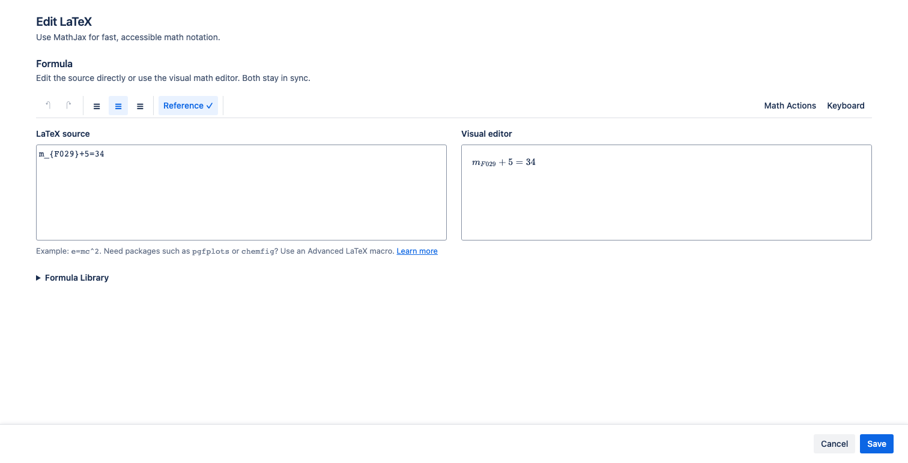
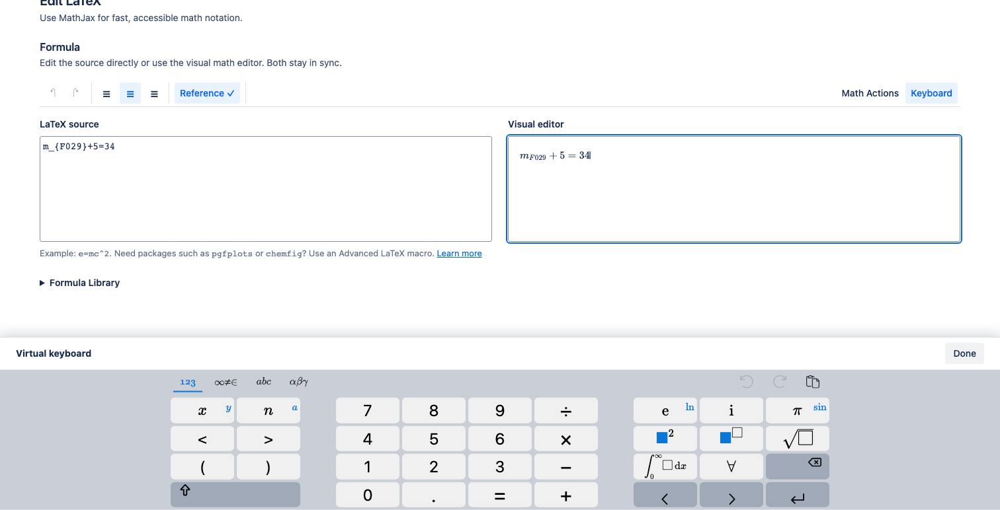
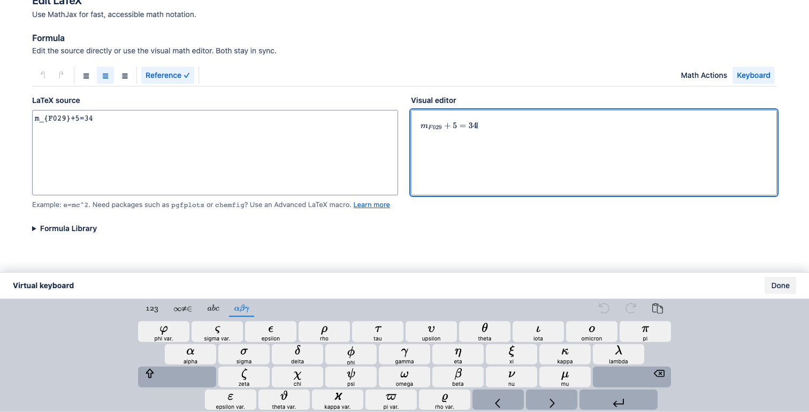

The MathJax editor gives beginners and experienced LaTeX users two synchronized ways to edit the same formula.

## Edit source and visual math side by side

- Use **LaTeX source** when you know the command you want or need precise control.
- Use **Visual editor** to edit the rendered mathematical structure directly.

Typing in either surface updates the other. On narrower windows the surfaces stack so each remains usable.

## Undo and redo changes

Use the first two toolbar actions to undo or redo formula-content changes. The shared history includes changes made through:

- source typing;
- visual editing;
- Formula Library insertion;
- Math Actions;
- the virtual keyboard.

Alignment and reference metadata are separate from formula-content history.

## Align a display formula

For **LaTeX Math — display**, choose the left, center, or right alignment icon. The selected action shows the current alignment and is saved with the macro.

Inline formulas do not have alignment controls because their position follows the surrounding paragraph.

## Insert reusable mathematical structures

Select **Math Actions** for structures supplied by the visual math editor, including fractions, roots, derivatives, integrals, sums, products, complex-number helpers, and matrices from 1×1 through 5×5.

Use [Formula Library](../formula-library/) when you want a complete named formula rather than a generic structure.

## Use the virtual keyboard

1. Select **Keyboard** in the editor toolbar.
2. Choose a layout: Numeric, Symbols, Alphabetic, or Greek.
3. Insert symbols or use navigation and editing keys while the visual editor is active.
4. Select **Done**, or press Escape, to close the keyboard and restore the Save/Cancel footer.

Switch to the **Greek** layout when you need common lowercase and uppercase Greek symbols without remembering their LaTeX commands.

The keyboard is a bottom-docked editor surface. It may cover the Save and Cancel actions while open, but it keeps the formula inputs visible and restores the footer when closed.

## Save versus publish

**Save** closes the macro editor and applies the configuration to the page draft. Readers do not see that change until you select **Publish** or **Update** in Confluence.
