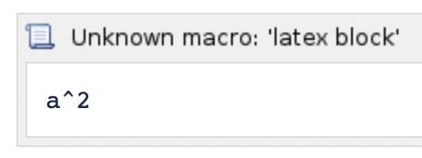
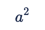
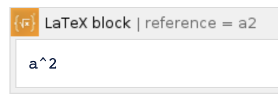

When the addon was created, the macro names contained space characters. With recent versions of Confluence Server and Confluence Data Center, the macro editor will be displayed with the "Unknown macro" message.

The macros still correctly render the LaTeX content, for example: .

To resolve the issues, from version 4.0.0, a new set of macro names are used.

The existing macros still work and you can edit the LaTeX content of the old macros. You only need to replace the old macros with the new ones when you want to use new functions such as adding reference numbers to the LaTeX content.

If you want to migrate all old macros to the new ones, please follow the same instructions at [Migrate to Confluence Cloud](../migrate-to-confluence-cloud/).
