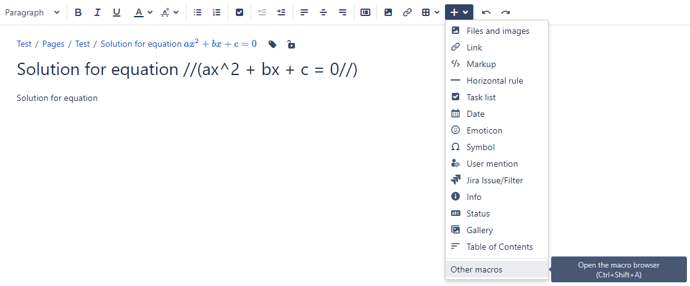
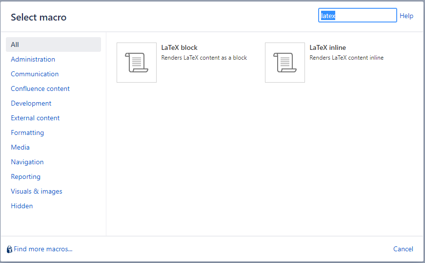
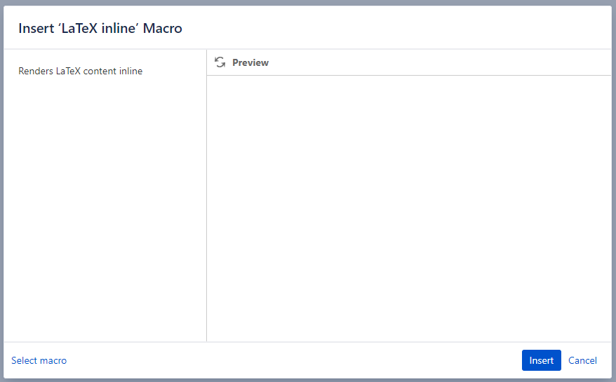
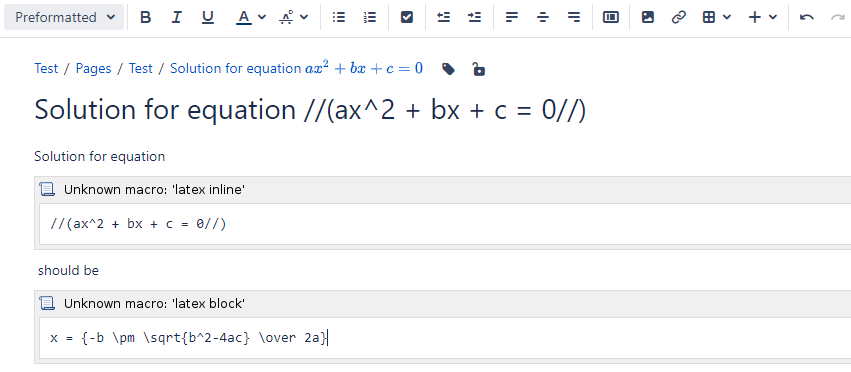
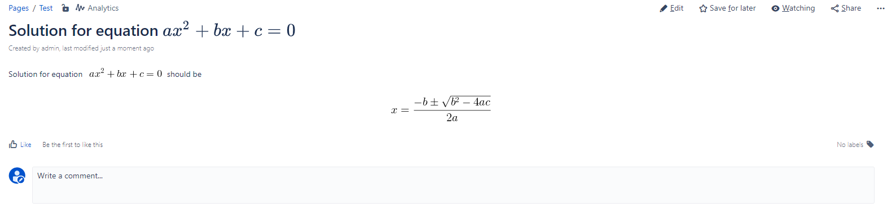
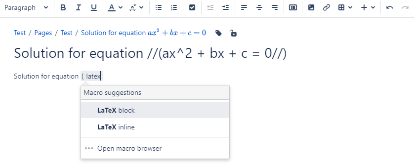
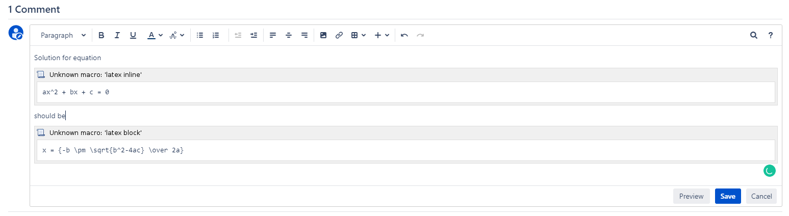
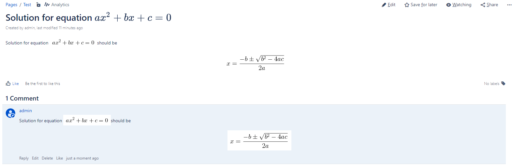
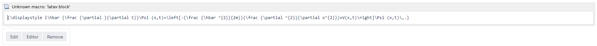
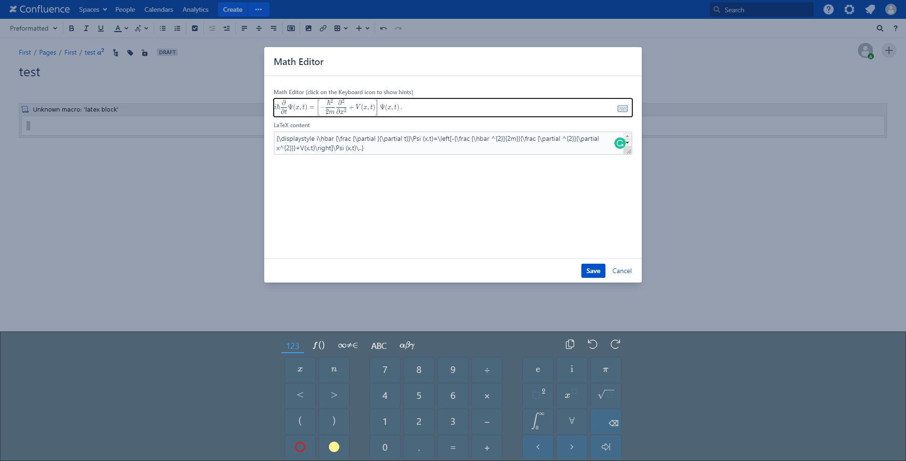

[Watch the video](https://www.youtube.com/watch?v=-yzSSANd9SI)
LaTeX for Confluence

## Page Title

For Page Title, inline LaTex must be wrapped inside `//(...//)`  and LaTex block must be wrapped inside `//[...//]`.

## Page Content

### Using GUI

Open the macro browser.

Select the macro you want to use.

Select **Insert**.

Provide the LaTeX content.

Save the page content.

### Using markup

Macros can also be inserted quickly by typing `{.`

## Comment

You can write LaTeX content in comments in similar ways.

## Math Editor

If you are not familiar with LaTeX, you can make use of Math Editor while editing the macro content.

To open Math Editor, select the macro, and click on the **Editor** button on the quick toolbar.

The Math Editor dialog will show up. Click on the **Keyboard icon** to show the virtual keyboard with many predefined LaTeX symbols.

## Mobile support

