## Notice

> **It is recommended to use this Jira app with browser extension, since the combination provides the flexibility to write LaTeX in everwhere: Summary, Description, Comment, custom fields, etc. Please see the instructions here** [**https://docs.fulstech.com/latex/latex-for-jira/jira-cloud/usage-with-browser-extension/**](../usage-with-browser-extension/)**.**

## Overview

After installing and starting the trial period, the app will add a custom field name **LaTeX text** to the Jira instance.

The first step is to add the custom field **LaTeX text** to issue types and projects.

## For classic Jira projects

### Associate the LaTeX custom field to issue screens

Navigate to the **Custom fields** page.

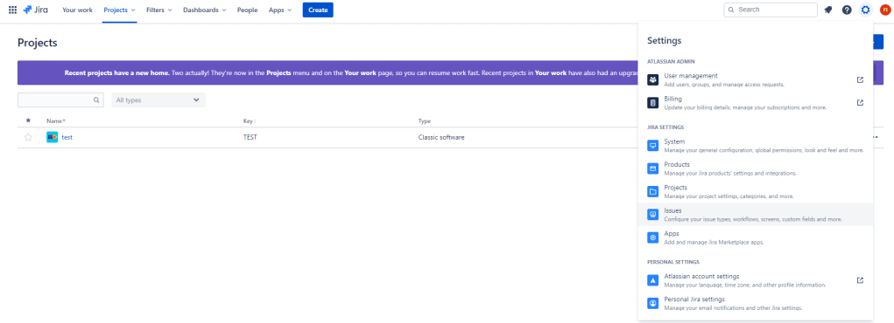

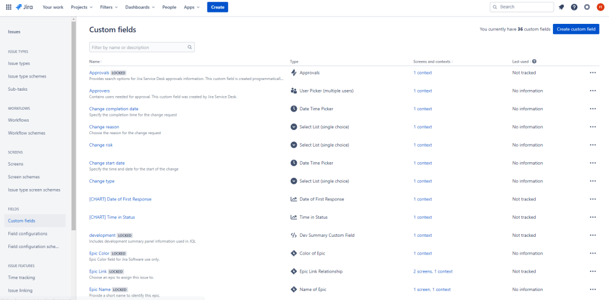

Search for the custom field **LaTeX text** and add it to screens.

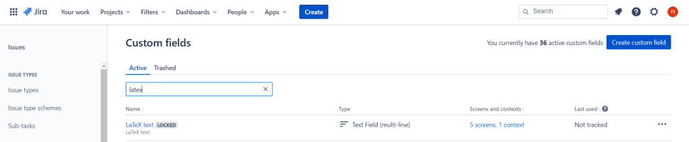

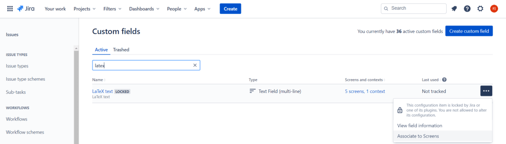

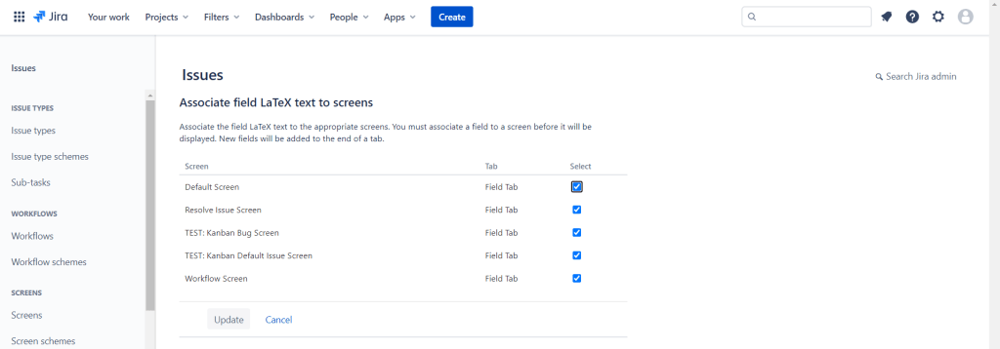

### Add the **LaTeX** panel to the issue screen

On an issue view, click on the “three dots” icon and select **LaTeX**.


## For Next-gen Jira projects

Click on **Project settings** on the left sidebar.

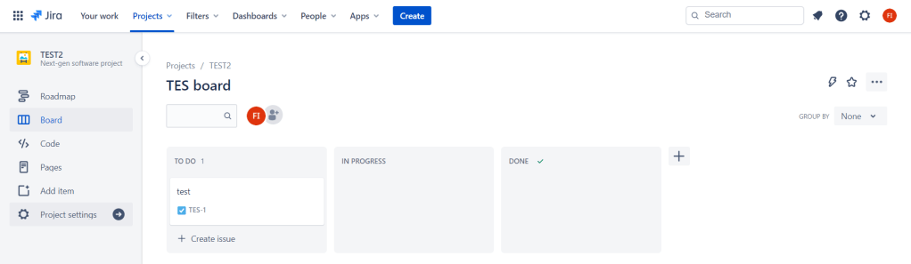

On the **Project settings** page, click on **Apps** on the left sidebar.

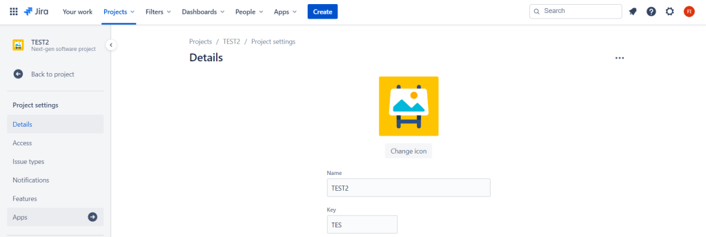

Click on **App fields** on the left sidebar and enable **LaTeX for Jira Cloud.**

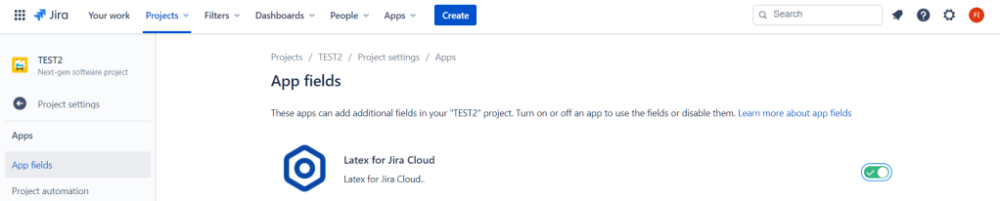

Go back to the **Project settings** page, click on **Issue types** on the left sidebar.

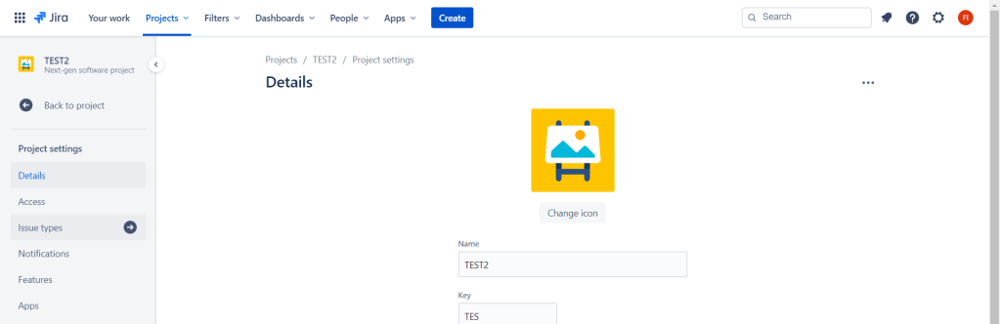

Drag the **LaTeX text** field from the right sidebar and drop it into the **Description fields** area.

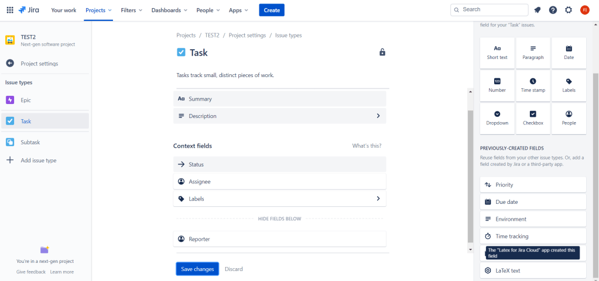

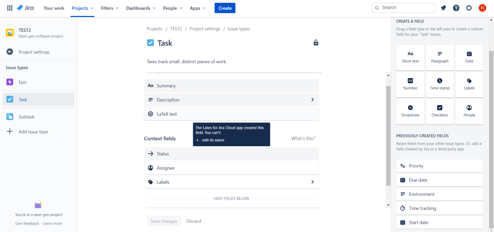

## Add LaTeX formulas to an issue

Click on the **Edit** button.

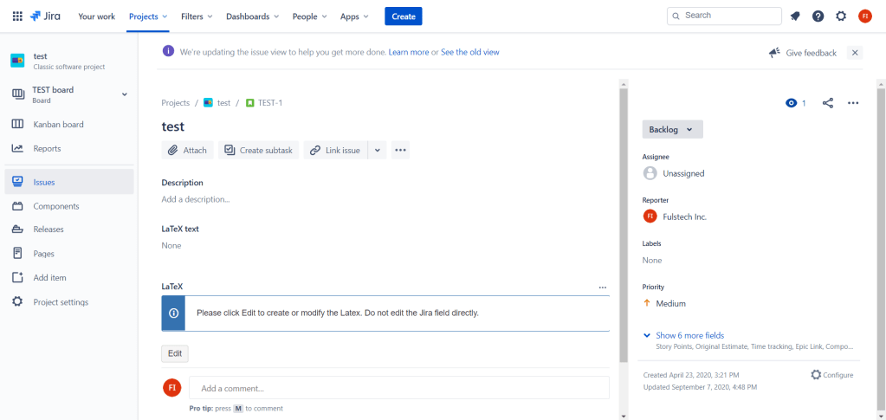

**Please do not edit the custom field itself. Whenever you want to add or modify the formulas, please use the app’s Edit button.**

The LaTeX content is wrapped around by **{latex}…{latex}**.

Sample content:

```
{latex}
ax^2 + bx + c = 0
{latex}

{latex}
x = \frac{{ - b \pm \sqrt {b^2 - 4ac} }}{{2a}}
{latex}
```

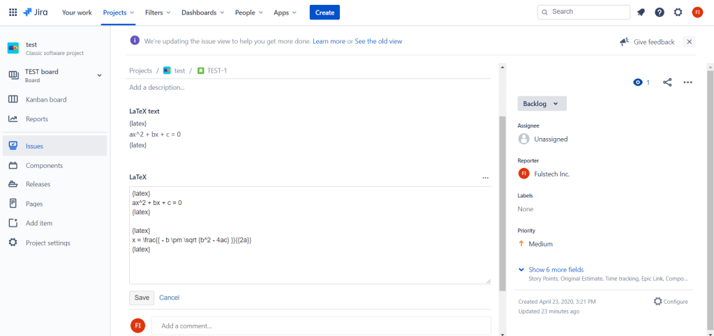

After that, click **Save**.

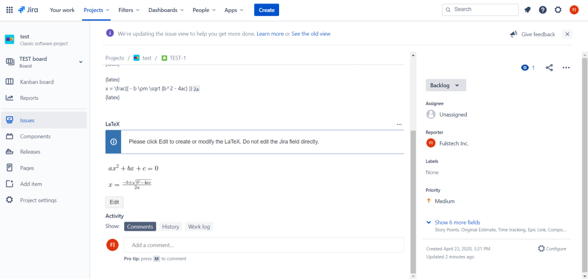
