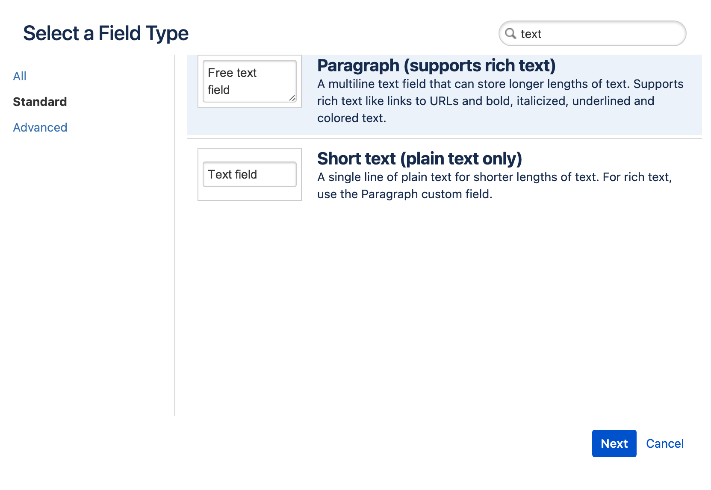
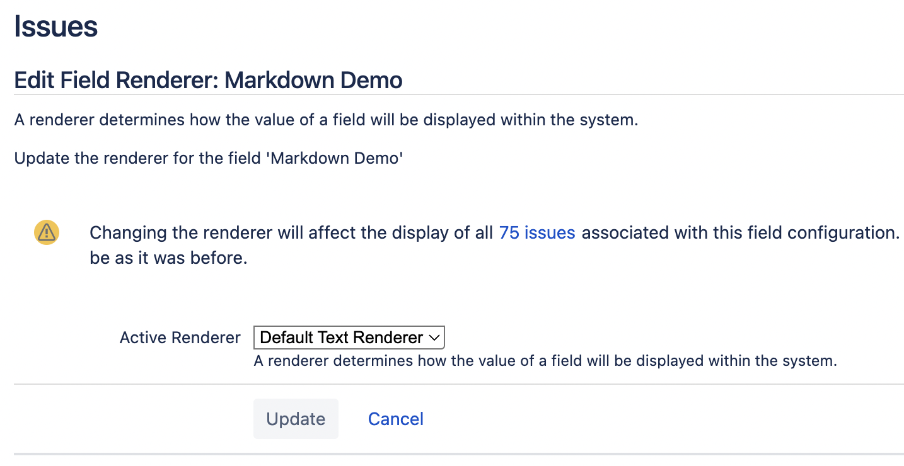
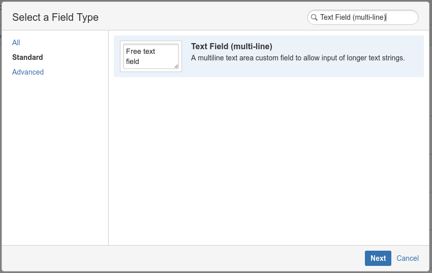
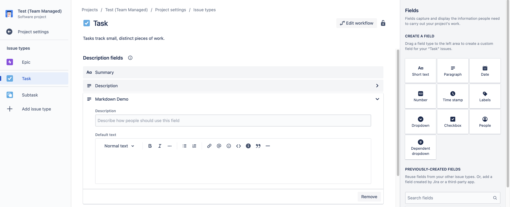
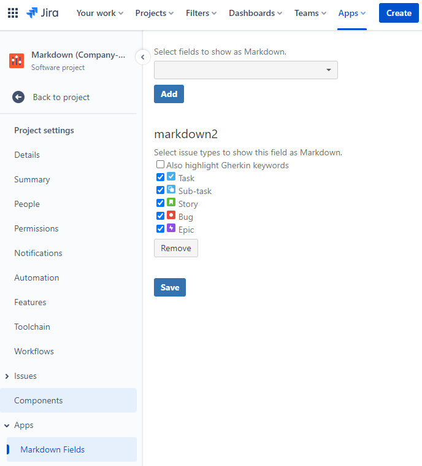
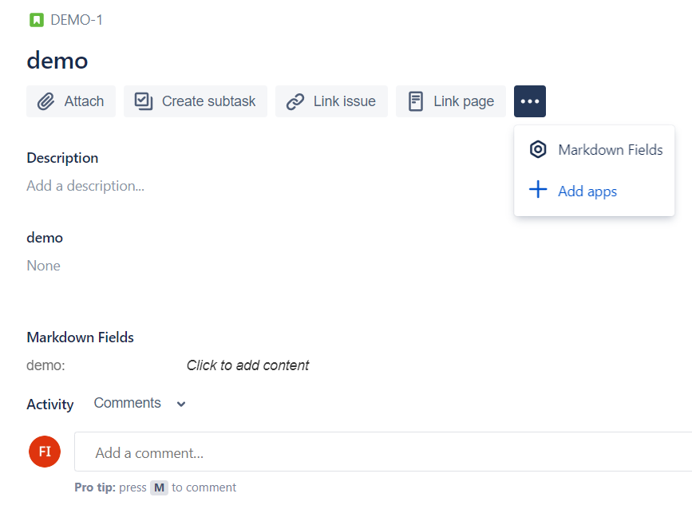
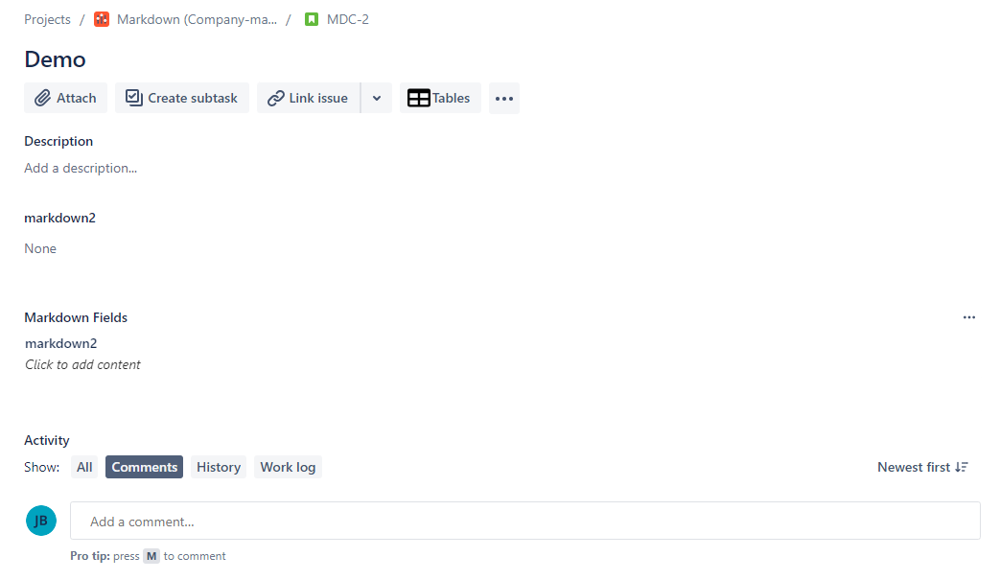
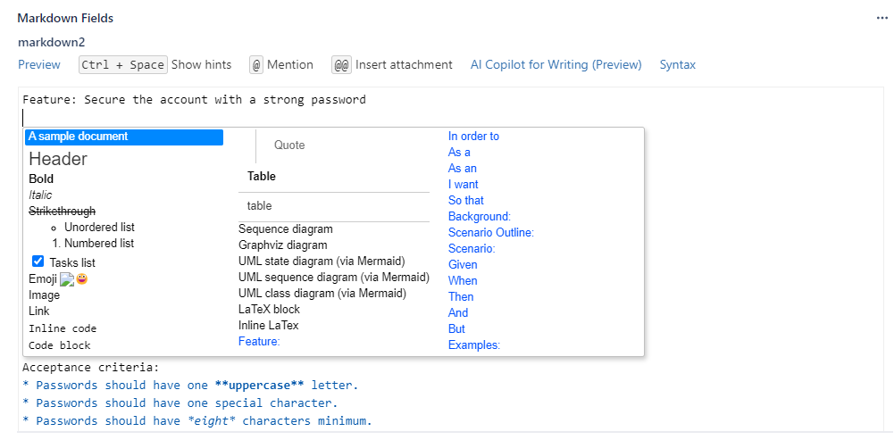
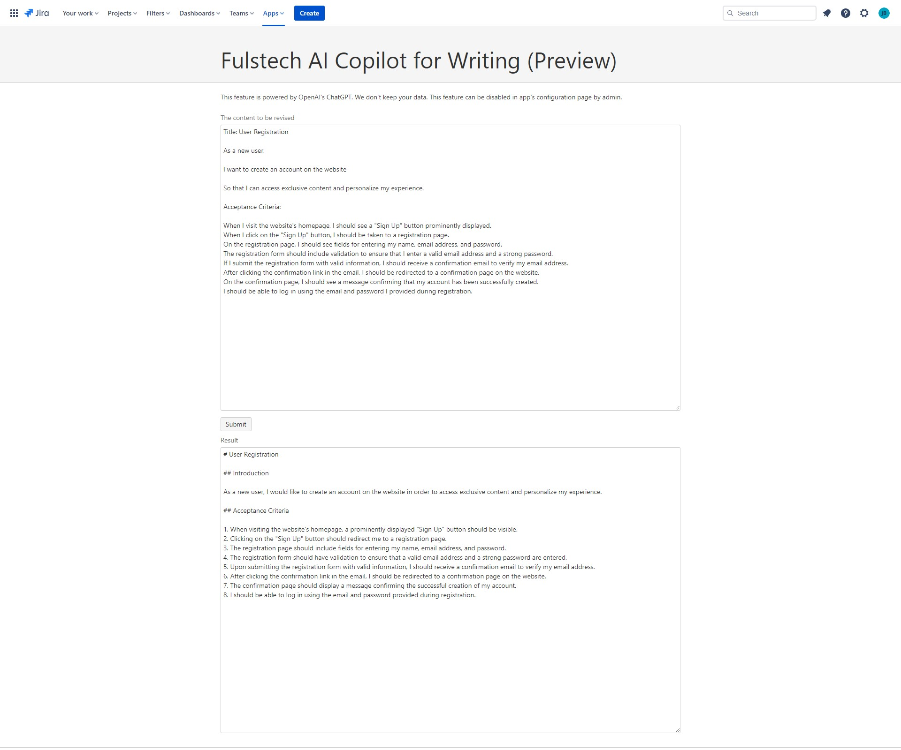
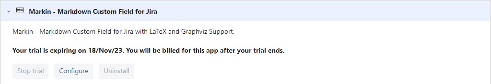

Since it is impossible for a Jira Cloud's app to create its own custom field type, Markin provides Markdown Editor for fields of Jira Cloud’s built-in types. This gives you important benefits:

* All Markdown data is stored securely in your Jira Cloud the same way other Jira data is stored. **Your data will never be stored on our site.**
* Search, JQL, export, API, email notifications, and other field-related utilities will work the same way other fields work.

Please follow the instructions below to create a Markdown-enabled custom field.

## Create a new custom field

### Company-managed projects (classic projects)

#### New Jira Cloud UI

Create a new custom field of type **Paragraph (supports rich text)**. Configure the custom field (name, description, screens) normally. The renderer must be **Default Text Renderer.**

#### Old Jira Cloud UI

Create a new custom field of type **Text Field (multi-line)**. Configure the custom field (name, description, screens) normall&#x79;**.**

### Team-managed projects (nextgen projects)

Create a custom field of type **Paragraph**.

## Configure the newly created custom field as a Markdown field

Go to the **Project Settings** page of the corresponding project. Select **Markdown Fields** under the **Apps** menu. In the configuration page, select the field created in Step 1 along with all issue types in which you want it to appear as Markdown content.

Optionally you can turn on/off highlighting Gherkin keywords.

## Create an issue for testing

Create an issue for testing. Click on the **More Options (three-dots)** button. You should see the **Markdown Fields** section. The fields configured in the above steps should be displayed in the section.

Click on the fields inside the **Markdown Fields** panel to edit the content.

> **warning**
>
DO NOT edit the fields using Jira's built-in editors outside the **Markdown FIelds** panel.

## Hide the original field editor

**If your project is company-managed (formerly classic),** you can also hide the original field editor. Please see the instructions here <https://support.atlassian.com/jira-software-cloud/docs/configure-field-layout-in-the-issue-view/#Configurefieldlayoutintheissueview-Hiddenfields>.

## Fulstech AI Copilot for Writing (Preview)

AI Copilot leverages OpenAI's ChatGPT to help you revise the content effectively.

> **info**
>
This feature is powered by OpenAI's ChatGPT. The data you submit and the responses you receive are not used to fine-tune or improve OpenAI’s models or services. Each data request is sent to OpenAI individually, over an SSL-encrypted service, to process and send back to your Jira. OpenAI does not store the data you submit or the responses you receive.

To disable the feature, please click on the **Configure** button on the Jira Plugin Manager page.

