## Overview

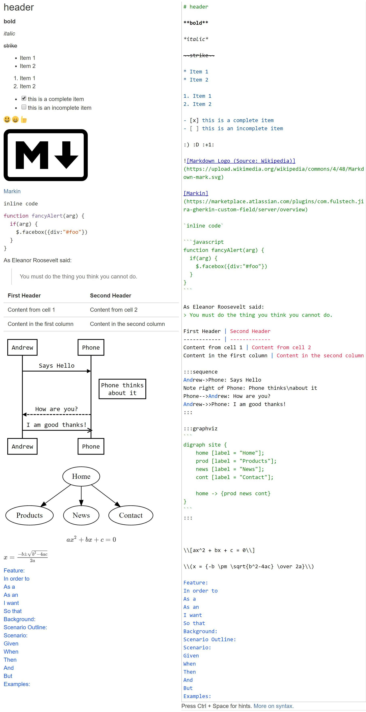

## Autocompletion

You can get a list of all available syntax by pressing `Ctrl + Space` in the editor. A context menu with all available syntax will appear.

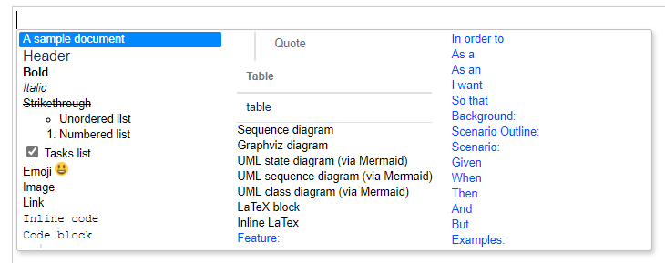

To move between items, use `Up`, `Down`, `Left`, `Right` keys. To select an item, click on it or press `Enter`. An example will be inserted.

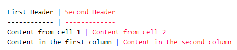

## LaTeX Math formulas

### Block formulas

```latex
\\[ax^2 + bx + c = 0\\]
```

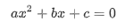

### Inline formulas

```latex
\\(x = {-b \pm \sqrt{b^2-4ac} \over 2a}\\)
```

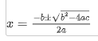

## Sequence diagrams

Learn more about the syntax here: <https://bramp.github.io/js-sequence-diagrams>.

````markdown
:::sequence
```
User->Phone: Says Hello
Note right of Phone: Phone thinks\nabout it
Phone->User: How are you?
User->>Phone: I am good thanks!
```
:::
````

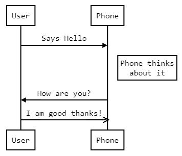

## Graphviz diagrams

Learn more about the syntax (Graphviz DOT) here: <http://www.graphviz.org/>.

````dot
:::graphviz
```
digraph site {
    home [label = "Home"];
    prod [label = "Products"];
    news [label = "News"];
    cont [label = "Contact"];

    home -> {prod news cont}
}
```
:::
````

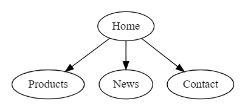

## Mermaid UML diagrams

Learn more about Mermaid UML diagrams here: <https://mermaid-js.github.io/mermaid/#/>.

Here we are just showing some examples.

### State diagrams

````mermaid
:::uml
```
stateDiagram
        [*] --> Still
        Still --> [*]
        Still --> Moving
        Moving --> Still
        Moving --> Crash
        Crash --> [*]
```
:::
````

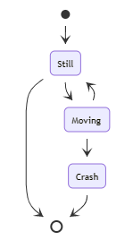

### Sequence diagrams

````mermaid
:::uml
```
sequenceDiagram
    autonumber
    Alice->>John: Hello John, how are you?
    loop Healthcheck
        John->>John: Fight against hypochondria
    end
    Note right of John: Rational thoughts!
    John-->>Alice: Great!
    John->>Bob: How about you?
    Bob-->>John: Jolly good!
```
:::
````

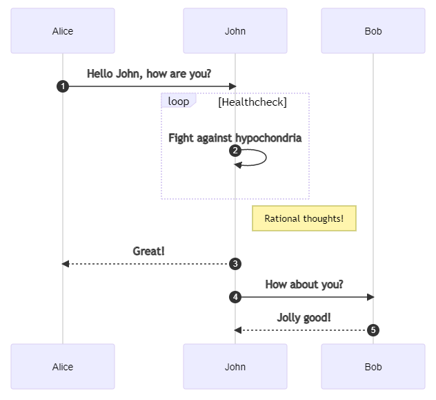

### Class diagrams

````mermaid
:::uml
```
classDiagram
Class01 <|-- AveryLongClass : Cool
Class03 *-- Class04
Class05 o-- Class06
Class07 .. Class08
Class09 --> C2 : Where am i?
Class09 --* C3
Class09 --|> Class07
Class07 : equals()
Class07 : Object[] elementData
Class01 : size()
Class01 : int chimp
Class01 : int gorilla
Class08 <--> C2: Cool label
```
:::
````

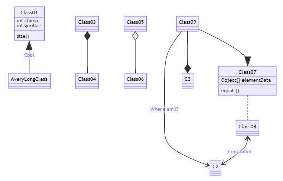

## Markdown syntax

### Heading

```markdown
# The largest heading
## The second largest heading
###### The smallest heading
```

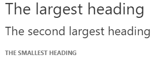

### Styling text

```markdown
**bold**

*italic*

~~Strikethrough~~
```

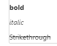

### Lists

```markdown
* Item 1
* Item 2

1. Item 1
2. Item 2
```

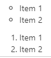

### Task lists

```markdown
- [x] this is a complete item
- [ ] this is an incomplete item
```

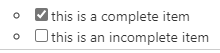

### Using emoji

```markdown
:) :D
```

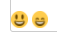

### Mentioning people <a href="#mentioning-people" id="mentioning-people"></a>

Type `@` and select the user to be mentioned.

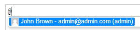Input

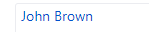Render

### Inserting attachments as images <a href="#inserting-attachments-as-images" id="inserting-attachments-as-images"></a>

Type `@@` and select the attachment to be inserted.

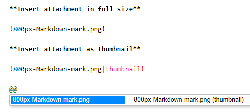

### Images

```markdown

```


### Links

```markdown
[Markin](https://marketplace.atlassian.com/plugins/com.fulstech.jira-gherkin-custom-field/server/overview)
```

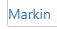

### Code snippets

````markdown
`inline code`

```javascript
function fancyAlert(arg) {
  if(arg) {
    $.facebox({div:"#foo"})
  }
}
```
````

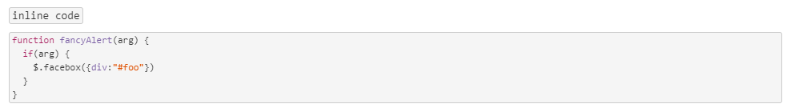

### Quote blocks

```markdown
As Eleanor Roosevelt said:
> You must do the thing you think you cannot do.
```

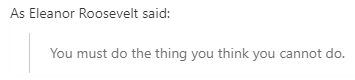

### Tables

```markdown
| First Header | Second Header |
| - | - |
| Content from cell 1 | Content from cell 2 |
| Content in the first column | Content in the second column |
```

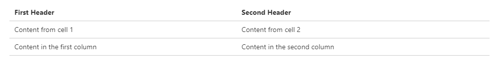

## Gherkin syntax

> **Please enable Gherkin syntax first before using this feature.**

```gherkin
Scenario Outline: Password should be secure enough

Given a new password is being set
When I try to set the password to <new password>
Then the password should be considered <secure?>

Examples:
| new password | secure? | notes                  |
| -            | -       | -                      |
| p@swrd1;     | :(      | No uppercase character |
| Passwrd1     | :(      | No special character   |
| P@swrdl;     | :)      | -                      |
```

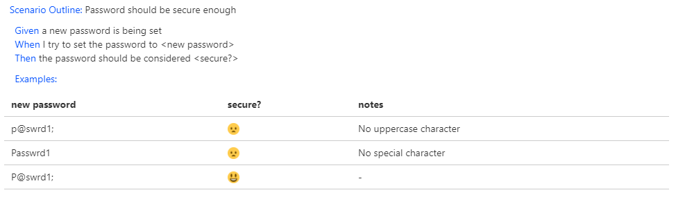
