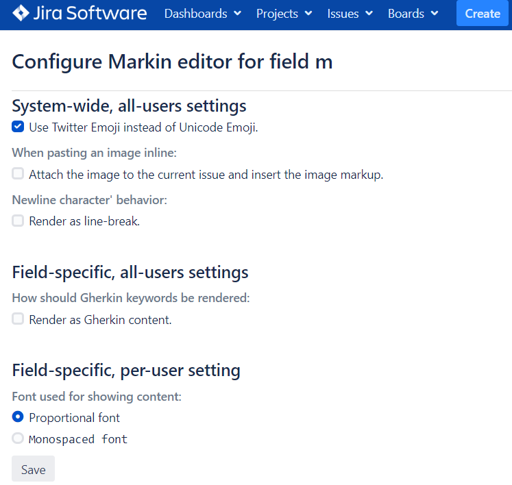

## Create a Markdown-enabled Custom Field

To use Markin for custom fields, follow the instruction at <https://confluence.atlassian.com/jira/adding-a-custom-field-185729521.html>. The custom field type is **Markin Editor**.

## Use Markdown for System Fields (Description, Comment)

To use Markin for system fields, follow the instruction at \[<https://confluence.atlassian.com/adminjiraserver073/specifying-field-behavior-861253403.html#Specifyingfieldbehavior-renderersChangingafield'srenderer](https://confluence.atlassian.com/adminjiraserver073/specifying-field-behavior-861253403.html#Specifyingfieldbehavior-renderersChangingafield'srenderer>). The renderer type is **Markin renderer**.

## Other field-level settings

Hover on a field, the link to the Settings page will be shown at the bottom.

You can then configure how Markin renders the Markdown content.

