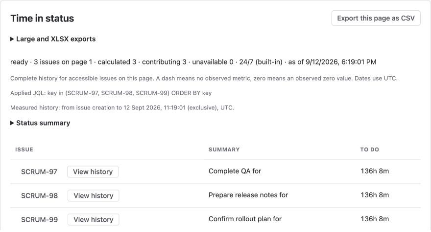

See where Jira work spends its time — from the first status to completion.
Use your team's statuses and working calendar to understand waiting, delivery and handoffs.

import { CardGrid, LinkCard } from '@astrojs/starlight/components';

<CardGrid>
  <LinkCard title="Create your first report" description="Choose a project, select a metric and see your results." href="../getting-started/" />
  <LinkCard title="Find bottlenecks" description="Compare groups, trends and aging work." href="../report-analysis/" />
  <LinkCard title="Use working hours" description="Exclude weekends, breaks and non-working dates." href="../working-calendars/" />
  <LinkCard title="Share and export" description="Reuse settings, schedule reports and download CSV or XLSX." href="../sharing-and-schedules/" />
</CardGrid>

## See your workflow at a glance

*Example report using demonstration issues. Your status names and results come from Jira.*

| Your question | Report to use |
| --- | --- |
| Where does work wait? | Time in status |
| How long does delivery take? | Cycle time or Lead time |
| Which issues need attention? | Open work aging |
| Who owned an issue at each stage? | Assignee by status |
| How are results changing? | Status time by period or Delivery trend |

**Assignee time is elapsed ownership, not hours worked.** The app focuses on workflow time; timesheets and billing are outside its scope.

Need help? Visit [Support](../support/) or read [Data and Privacy](../security-and-data/).
