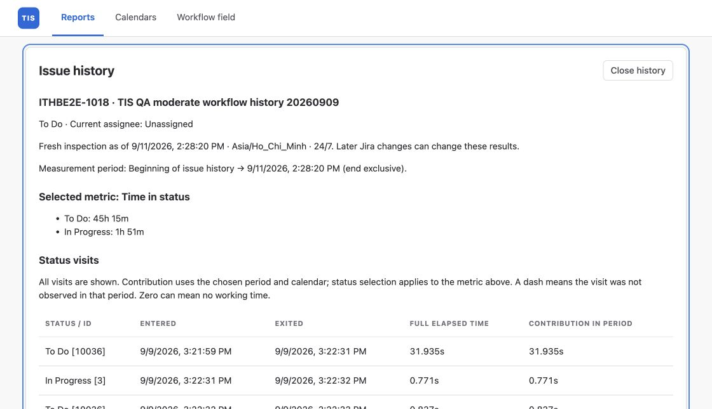

Choose a question under **Start with a question**, select **Use this question**, then review the suggested settings and run your report.

## Choose a metric

| To find… | Choose… |
| --- | --- |
| Time spent in each status | **Time in status** |
| Workflow loops and rework | **Status count** or **Transition count** |
| When a status was entered | **First status entrance** or **Latest status entrance** |
| Duration through your workflow | **Cycle time** or **Lead time** |
| Where time occurred each week/month | **Status time by period** |
| Completed work each week/month | **Delivery trend** |
| Open issues needing attention | **Open work aging** or **Current visit age** |
| Ownership by person or status | **Assignee time** or **Assignee by status** |
| Changes in a supported Jira field | **Jira field duration** or **Jira field value count** |

## Compare groups

1. Expand **Group results** and choose **First dimension**.
2. Optionally add **Second dimension**.
3. Choose **Total**, **Mean per contributing issue** or **Median per contributing issue**.
4. Run the report. Select a grouped value to inspect its contributing issues.

Use **View history** on an issue row to inspect individual visits.

*Example visit history for a demonstration issue.*

## Choose how to count repeat visits

Under **Time in status → Repeated status visits**, choose the rule that answers your question.

| For visits of 2 hours and 6 hours | Result |
| --- | --- |
| Total of all visits | 8 hours |
| First observed visit | 2 hours |
| Latest observed visit | 6 hours |
| Average observed visit | 4 hours |

## Understand the calculation

Status groups, counts and entrance dates

Use **Statuses and optional groups** to map your own workflow, such as Waiting or Active work.
The repeat-visit rule applies inside each issue and status before grouping. Status groups combine their member values.
Do not add overlapping groups together or add a group to its member statuses.

Status count includes the initial status at creation. Transition count is directional; selecting statuses filters destinations.
Entrance dates refer to the first or latest observed entrance in the measurement window and remain in issue rows.

Cycle time and lead time

Cycle time sums time in your configured cycle statuses/groups without double-counting overlapping selections.
Lead time uses your selected states or a created-to-completion definition. Configure completion statuses to match your workflow.

Trends and reopened issues

**Status time by period** splits a visit across the weeks/months when its time occurred.
**Delivery trend** places completed issues in the period when they entered their current completion block.
Reopened issues are excluded until completed again. Review the window and calendar; the current period is still incomplete.

Open work aging

Configure cycle and completion statuses, then set **Minimum cycle age (hours)**.
Cycle age starts with entry into the first configured cycle status in the current delivery episode.
Current-status age measures only the current visit. Both measure up to now, independently of the history period.
One-page reports rank that page; all-pages reports rank the collected issues.

Group totals, averages and missing values

Grouping uses current Jira fields, not historical team membership. Issues with multiple components can appear in multiple groups.
Mean and median exclude missing measurements and include measured zeros. The Time in Status summary counts each issue once per metric.

Ownership and Jira field history

Assignee metrics measure elapsed ownership, not logged effort or productivity.
For field duration/count, choose a supported field offered by the app. Duration measures how long each value was held;
count measures entrances into a value. Only history available from Jira can be measured.

