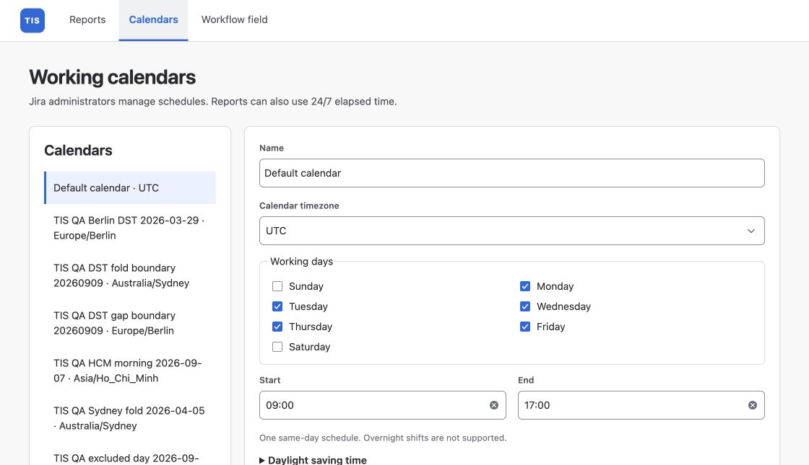

Use a calendar when weekends, breaks or holidays should not count toward duration.

## Set up working hours

1. As a Jira administrator, open **Calendars**.
2. Set the timezone, working weekdays, start and end times.
3. Add breaks and excluded dates, then save the calendar.
4. Return to **Reports** and select it under **Time calculation**.

*Example calendar settings. Select the calendar in your report to apply them.*

## See the difference

For Monday–Friday, 09:00–18:00, with no breaks or excluded dates:

| Issue interval | 24/7 elapsed time | Working time |
| --- | --- | --- |
| Friday 17:00 → Monday 10:00 | 65 hours | 2 hours |

Changing the report calendar recalculates the same history. Overnight shifts are not supported.

## Filter issues or measure a period?

| Setting | What it controls |
| --- | --- |
| Project or JQL | Which issues are selected |
| **Measure history during** | Which part of their history is measured |
| Calendar timezone | When working hours occur |
| Measurement timezone | Date-window boundaries and displayed dates |

For example, JQL on `created` selects issues created in a period; it does not limit their measured history to that period.

If a saved calendar is unavailable, select another calendar or **24/7 elapsed time**, then run again.
