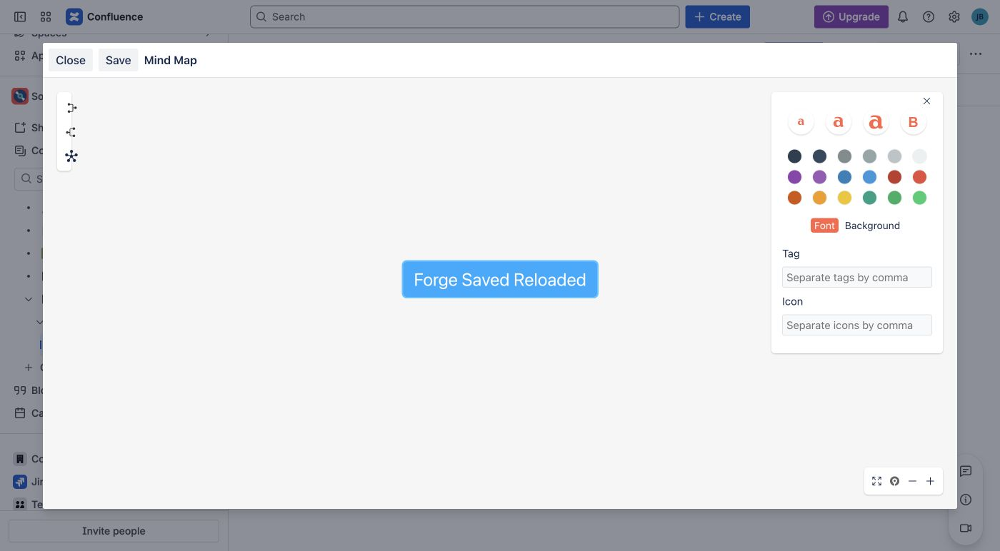
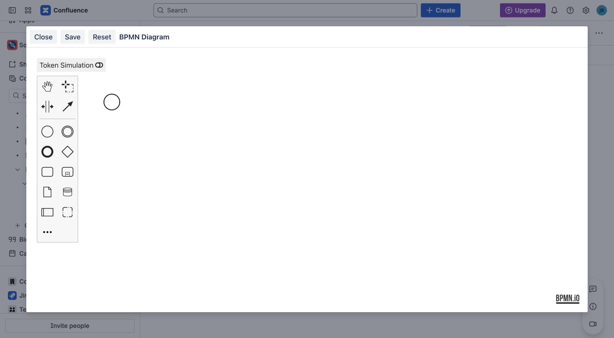
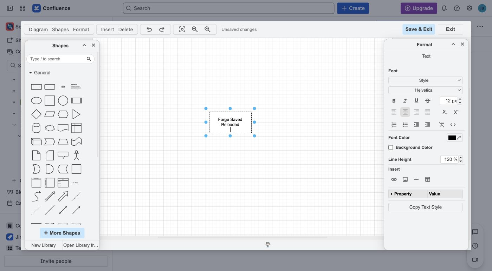

Canvas diagrams let you work directly with shapes, text, branches, or process
elements. This guide applies to the published Forge app, Cloud version
**3.0.0**.

Use [Choose the right diagram macro](../choose-a-diagram/) if you have not yet
selected an editor.

## Save and publish any canvas diagram

1. Edit a Confluence page.
2. Insert **Excalidraw Diagram**, **Mind Map**, **BPMN Diagram**, or
   **DrawIO Diagram (Powered by draw.io)**. To change an existing diagram,
   select its macro and choose **Edit**.
3. Build the diagram and review the complete result in the editor.
4. Choose **Save**. In DrawIO, choose **Save & Exit**.
5. Wait for the editor to return to Confluence.
6. Choose **Publish** for a new page or **Update** for an existing page.
7. Reload the published page and confirm that the complete diagram is visible.

Saving in the diagram editor updates the page draft. Readers do not see the
change until you publish or update the Confluence page.

## Sketch with Excalidraw

Use **Excalidraw Diagram** for whiteboards, architecture sketches, UI
wireframes, and informal diagrams.

- Select a shape tool, draw the shape, then type to label it.
- Use arrows to show direction or relationships.
- Double-click existing text to edit it.
- Use **Undo** and **Redo** to review changes before saving.
- Use **View mode** to inspect the drawing without editing it.

For a complete first example, follow
[Create your first Excalidraw drawing](../getting-started/).

_Select an element to change its stroke, background, and other drawing styles._

### Navigate and reset the Excalidraw canvas

- Use **Zoom in**, **Zoom out**, and **Reset zoom** to navigate the canvas.
- Turn on **Grid mode** to display a drawing grid. The grid is not part of the
  published diagram.
- Turn on **View mode** to inspect the drawing without editing it.
- Turn on **Zen mode** to reduce surrounding controls while you work.

**Reset Scene** restores the drawing loaded when you opened the editor and
removes your current unsaved changes. It does not restore an older Confluence
page version. Choose **Close** instead of **Save** when you want to leave without
applying current edits.

Fonts may finish loading shortly after the editor opens. Wait until the intended
font is visible before reviewing or saving the drawing. If Save reports that a
required font has not loaded, keep the editor open and retry after it loads.

### Reuse shapes with Personal Library

1. Select the shapes and text you want to reuse.
2. Open **Library** and choose the **+** thumbnail to add the selection.
3. Select a saved item's thumbnail to insert it into the current drawing.
4. Move the inserted content to the intended position, then save the diagram
   and update the Confluence page.

Adding a library item does not publish or change the page. Library items are
stored separately in this browser and are not a shared team library or a
cross-browser backup.

To download a library copy, open the three-dot menu beside **Personal Library**,
choose **Save to...**, and finish the browser's Save dialog. To import a library,
choose **Open** in the same menu and select an `.excalidrawlib` file. Do not use
the canvas menu's **Open**, which loads a drawing instead.

Import adds library items alongside existing items; it does not replace the
page's drawing. Keep the original export as a backup. If the editor reports that
library changes could not be saved, keep it open and use **Personal Library →
Save to...** before reloading or closing the editor.

## Build a Mind Map

Use **Mind Map** when the result should show a topic hierarchy.

1. Double-click the root topic and enter a useful name.
2. Select a topic and press **Tab** to add a child.
3. Rename the child, then continue adding branches.
4. Use **−** and **+** on a branch to collapse or expand its descendants.
5. Save, publish the page, then reopen the macro to confirm that the topics are
   still editable.

_Select a topic to edit its text, color, tags, and other node properties._

Choose **Close** without Save to leave the stored map unchanged. A changed topic
is not published merely because it appears on the editing canvas.

## Model a process with BPMN

Use **BPMN Diagram** when BPMN notation is meaningful to the audience.

1. Select the start event.
2. Use its context controls to append a task.
3. Label the task, then append an end event.
4. Check that the sequence flows connect Start → Task → End.
5. Save and publish the page.

Token Simulation can help you walk through the modeled path. It is an editing
aid and does not execute business actions in Confluence.

_Use the palette and an element's context controls to build a connected process._

### Simulate a BPMN process

1. Turn on **Token Simulation**.
2. Choose **Slow**, **Normal**, or **Fast** using the speed controls at the
   bottom of the canvas.
3. Trigger the start event and open **Simulation Log** to follow the process.
4. Use **Play/Pause Simulation** to pause or resume a moving token.
5. After the token reaches the end and displays **Finished**, use
   **Reset Simulation** to clear the run.

Simulation is an editing aid, not a workflow engine. Turn it off before
reviewing the normal diagram appearance. **Save** also turns simulation off
before creating the saved preview, so temporary simulation colors are not saved
as the diagram's colors.

To change a task's color, select it, choose **Set Color**, then choose a swatch.
To add a standalone task, choose **Create Task** from the left palette and place
it on the canvas; adding a task does not connect it automatically.

## Build a structured diagram with DrawIO

Use **DrawIO Diagram (Powered by draw.io)** when you need draw.io shape
libraries and its structured canvas.

1. Drag a shape from a library onto the canvas.
2. Add a label and connect any related shapes.
3. Choose **Save & Exit** and wait to return to Confluence.
4. Publish or update the page.

To leave without applying the current editor changes, choose **Exit** instead
of **Save & Exit**. If you changed the diagram, draw.io asks whether to discard
those changes. Confirm only when you no longer need the unsaved edits.

Saving requires both reusable diagram XML and a preview image. A save error is
not confirmation that the page draft was updated. Keep the editor open and
retry instead of publishing the page after a failed save.

_DrawIO keeps its shape libraries on the left, formatting controls on the
right, and **Save & Exit** in the top toolbar._

## Next steps

- [Troubleshoot an editor or save problem](../troubleshooting/).
- [Create diagrams from text](../text-diagrams/).
- [Upgrade existing diagrams from Connect](../upgrade-from-connect/).
