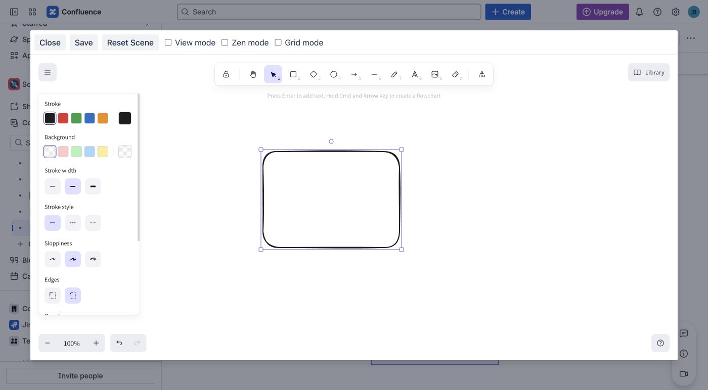

Create a small request-flow drawing, publish it, and reopen it for editing. This
guide applies to the published Forge app, Cloud version **3.0.0**.

## Before you start

- The app must be installed with an active Marketplace license or trial.
- You need permission to edit and publish the target Confluence page.

## Create and publish the drawing

1. Open a Confluence page and select **Edit**.
2. Type `/Excalidraw`, then choose **Excalidraw Diagram**. The diagram editor
   opens directly; there is no separate **Open Editor** step in Forge.
3. Draw two rectangles. Label the first **Browser** and the second **Service**.
4. Connect **Browser** to **Service** with an arrow.
5. Review the complete drawing, then select **Save**.
6. Wait for the editor to return to Confluence. Select **Publish** for a new
   page, or **Update** for an existing page.

_The Forge editor opens directly from the macro. Build and review the complete
drawing before choosing **Save**._

You have succeeded when the published page shows the drawing instead of the
macro editor or an empty placeholder. The two labels and connecting arrow should
all be visible.

## Understand the two save steps

- **Save** in the Excalidraw editor applies the drawing to the Confluence page
  draft.
- **Publish** or **Update** makes that draft visible to readers.

Wait for the diagram editor to close successfully before publishing the page.
If it stays open or reports an error, keep your work in the editor and follow
[The editor closed but the published page did not change](../troubleshooting/#the-editor-closed-but-the-published-page-did-not-change).

## Edit the drawing later

1. Edit the Confluence page.
2. Select the drawing and choose **Edit**.
3. Change the **Service** label to **API service**, then select **Save**.
4. Wait for the editor to return to Confluence, then select **Update**.
5. Reload the published page and confirm the label changed while both rectangles
   and their connecting arrow are still present.

Readers continue to see the previous published version until you select
**Publish** or **Update**.

## Next steps

- [Choose the right diagram macro](../choose-a-diagram/).
- [Create and edit canvas diagrams](../canvas-diagrams/).
- [Create diagrams from text](../text-diagrams/).
- [Reuse shapes with Personal Library](../feature-reference/#reuse-drawings-with-personal-library).
- [Troubleshoot a diagram](../troubleshooting/).

If your site still shows **Open Editor** and **Save and Close**, use the
[legacy Connect guide](../usage/). If **Save** does not return you to the page,
keep the editor open and follow
[Save and publish any diagram](../feature-reference/#save-and-publish-any-diagram).
