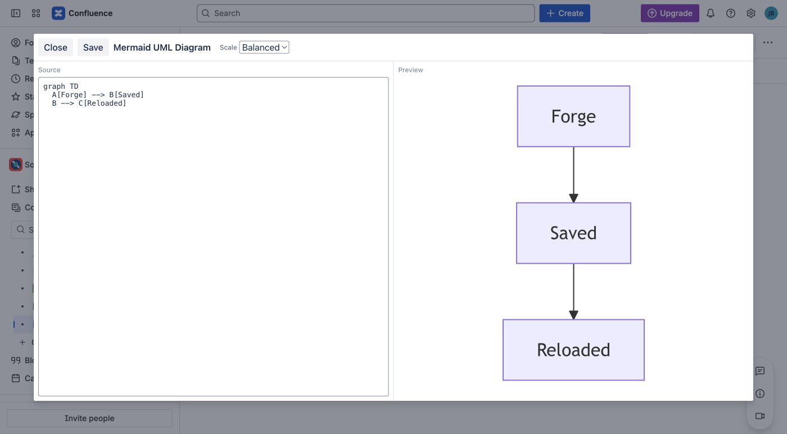
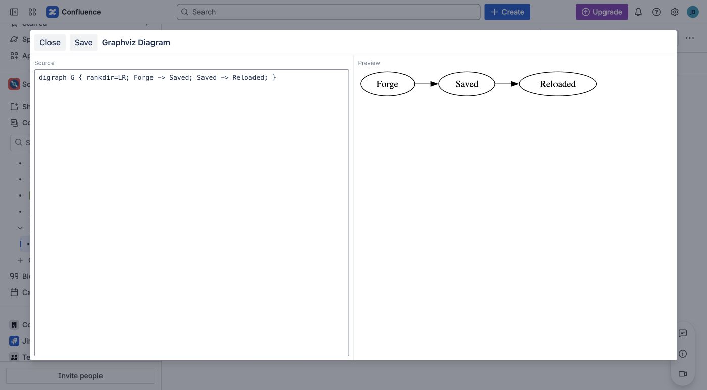
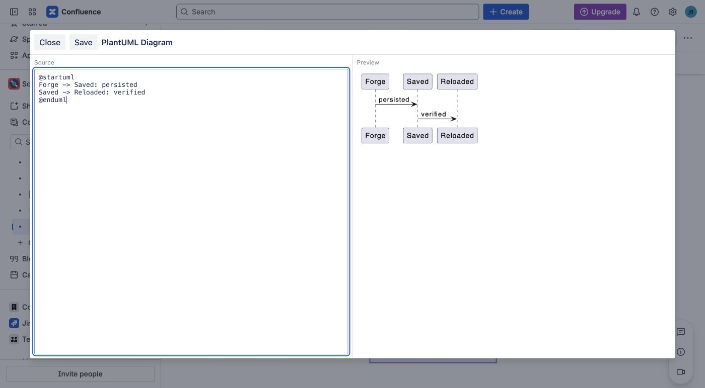

Text-defined diagrams turn readable source into a published diagram. This guide
applies to the published Forge app, Cloud version **3.0.0**.

## Choose the source language

| Macro | Source language | Good fit |
| --- | --- | --- |
| **Mermaid UML Diagram** | Mermaid | Flowcharts, sequence diagrams, state diagrams, Gantt charts, and other common diagram types |
| **Graphviz Diagram** | DOT | Dependency graphs and relationship maps with calculated layouts |
| **PlantUML Diagram** | PlantUML | UML and other diagrams supported by PlantUML syntax |

The languages are not interchangeable. Insert the macro that matches the source
you intend to maintain.

## Create and publish a diagram

1. Edit a Confluence page.
2. Insert **Mermaid UML Diagram**, **Graphviz Diagram**, or
   **PlantUML Diagram**.
3. Enter source for the selected language.
4. Review the preview. Fix the first reported syntax error before continuing.
5. Choose **Save** and wait for the editor to return to Confluence.
6. Choose **Publish** for a new page or **Update** for an existing page.
7. Reload the published page and review the complete diagram.

Saving the macro and publishing the Confluence page are separate steps.

## Try a Mermaid flowchart

Insert **Mermaid UML Diagram** and enter:

```text
flowchart LR
  Request --> Review
  Review --> Approved
```

The preview should show three nodes connected from left to right. Mermaid also
supports samples, configuration, Full view, image export, and manual preview
control. See [Use Mermaid editor tools](../mermaid-editor-tools/).



_The source and preview appear side by side. The screenshot uses different
sample text to show the editor layout._

## Try a Graphviz relationship graph

Insert **Graphviz Diagram** and enter:


The preview should show a directed graph laid out from left to right. Use the
[Graphviz gallery](https://graphviz.org/gallery/) for additional DOT examples.



_Graphviz calculates the layout from DOT source. The screenshot uses different
sample text to show the editor layout._

## Try a PlantUML sequence

Insert **PlantUML Diagram** and enter:

```text
@startuml
Requester -> Reviewer: Submit
Reviewer --> Requester: Approved
@enduml
```

The preview should show two participants and two messages. Use the
[PlantUML language reference](https://plantuml.com/) for other diagram types.



_PlantUML renders the source beside the editor. The screenshot uses different
sample text to show the editor layout._

## Work safely with source

- Keep a copy of source before reducing a failing diagram to a smaller example.
- Do not save while the preview still represents older source.
- Treat arrows as visual relationships. They do not become Confluence links or
  executable actions automatically.
- Review the published result after every change to configuration or syntax.

## Next steps

- [Use Mermaid configuration, export, samples, and Full view](../mermaid-editor-tools/).
- [Resolve a diagram that does not render](../troubleshooting/#a-mermaid-graphviz-or-plantuml-diagram-does-not-render).
- [Create and edit canvas diagrams](../canvas-diagrams/).
