## Excalidraw Macro

This macro helps you create figures, diagrams, and notes using Excalidraw. It's a powerful tool for brainstorming and visualizing ideas. This plugin uses a built-in Excalidraw version, therefore, your data will not be seen or stored by excalidraw\.com and will be securely kept in your Confluence instance.

### Insert Excalidraw drawings

Select the **Excalidraw diagrams** macro from the macro list.

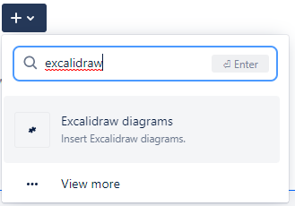

Click **Open Editor**.

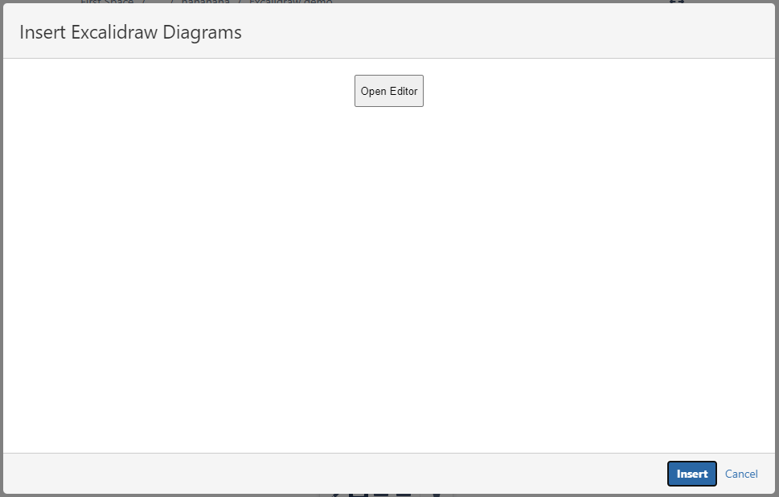

Draw anything you want. To draw perfect shapes like a circle, hold the **Shift** button while drawing.


Click **Save and Close**, and wait until the drawing shows up in the dialog. If you don't want to save the changes, click the **X** button on the top right corner.

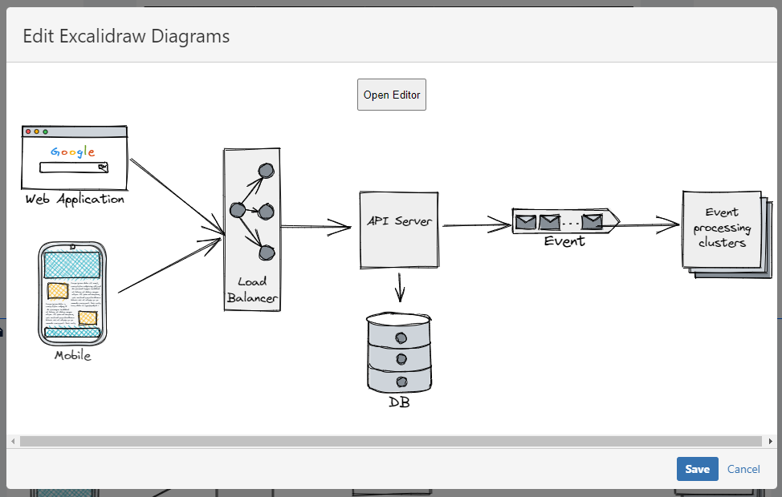

Click **Insert** (for new macro contents) or **Save** (for existing macro content).

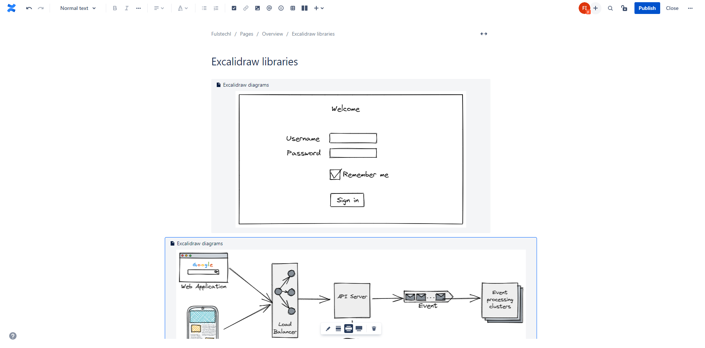

### Adding new shapes from the Excalidraw Libraries website

The Excalidraw Libraries website (<https://libraries.excalidraw.com>) provides a lot of useful shapes. These shapes are contributed by the community.

To add new shapes, visit the website and click the **Download** button to save the collection you need to your computer. The downloaded library file's extension is `.excalidrawlib`.

> **Do not use the Add to Excalidraw button, as the library will not be added to the plugin-hosted Excalidraw Editor.**

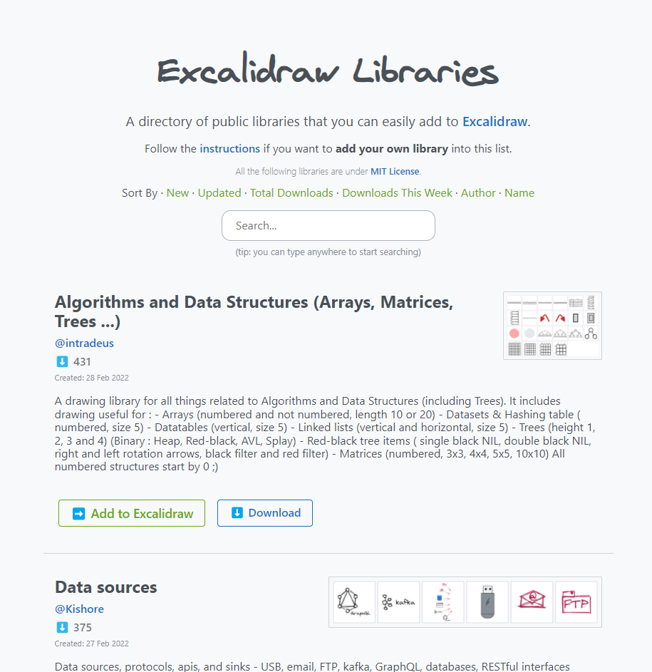

Open the Excalidraw Editor in Confluence, and upload the library file.

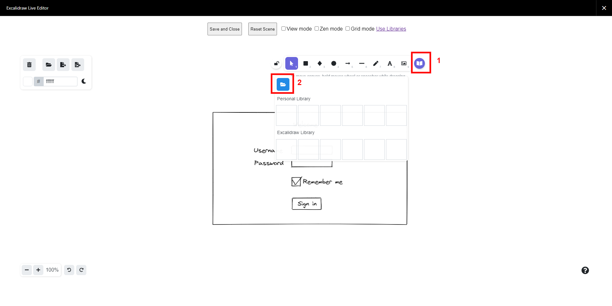

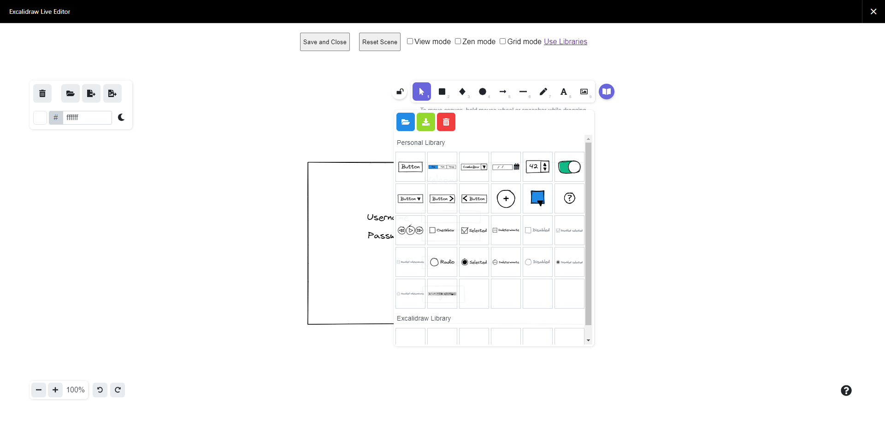

You can then drag and drop shapes into the canvas.

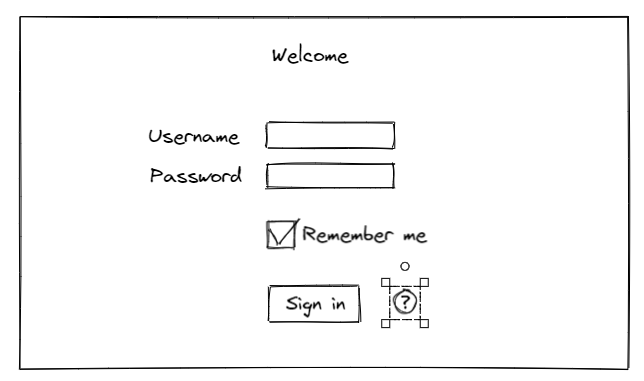

### Saving shapes as libraries

Let's say we want to save the following doughnut shape to reuse later. The first step is to select the whole shape.

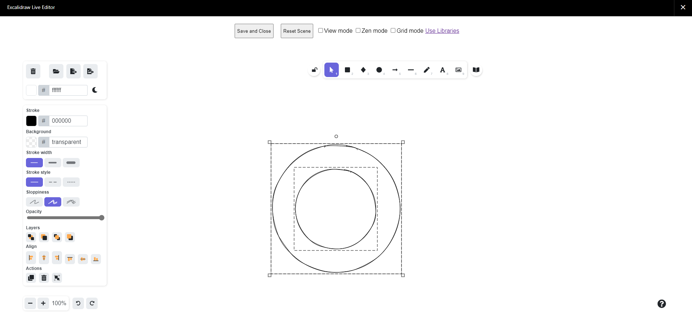

Add the selected shape to your library.

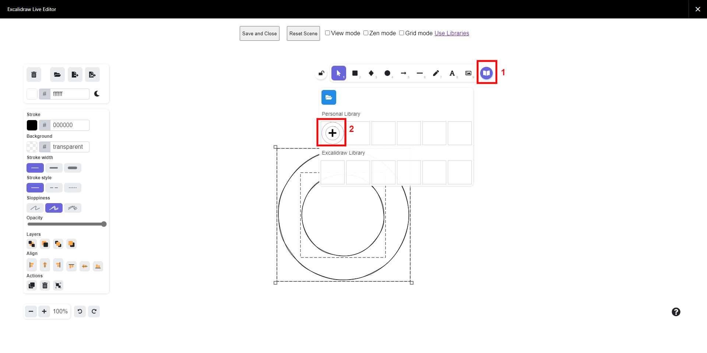

To save your library locally (for the backup purpose, for example), click the **Export** button.

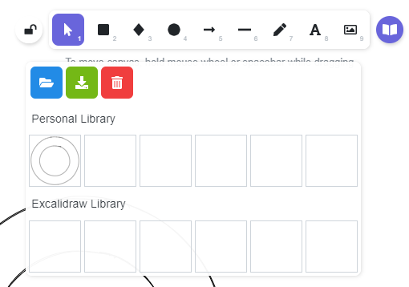

## Draw\.io Integration Macro

This macro helps you to use draw\.io to create multiple kinds of advanced diagrams. The macro uses the embedded version of draw\.io editor. If this is the first time you use draw\.io, please check out their privacy policy.&#x20;

### Insert Draw\.io drawings

Select the **DrawIO diagrams** macro from the macro list.

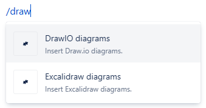

Click **Open Editor**.

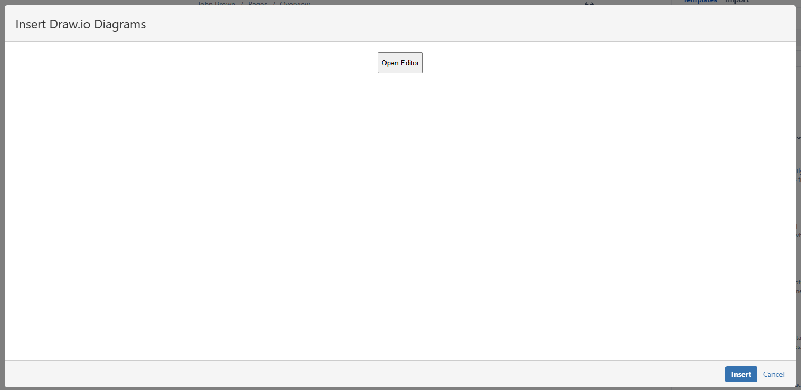

Draw anything you want.

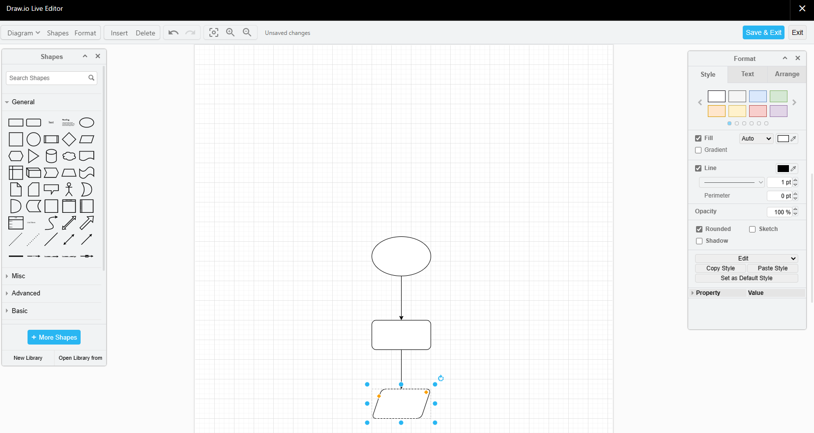

Click **Save & Exit**, and wait until the drawing shows up in the dialog. If you don't want to save the changes, click **Exit**.

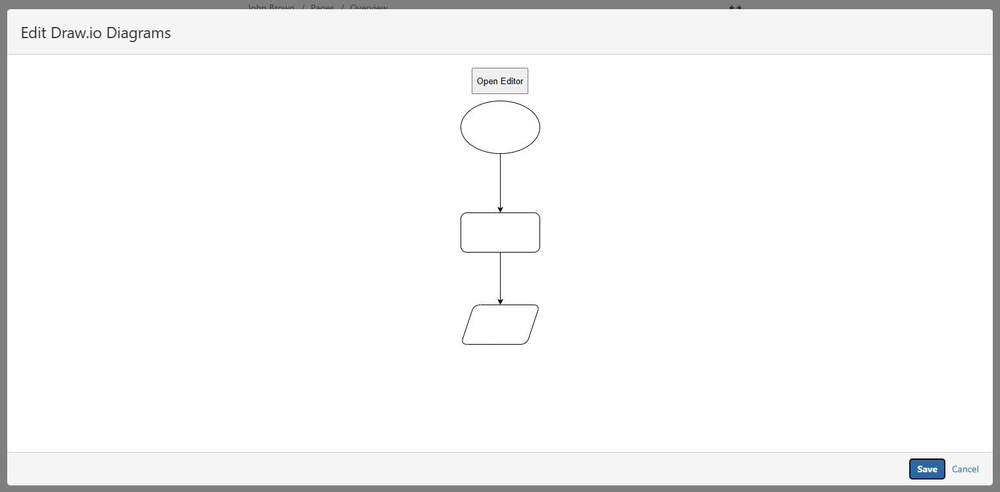

Click **Insert** (for new macro contents) or **Save** (for existing macro content).

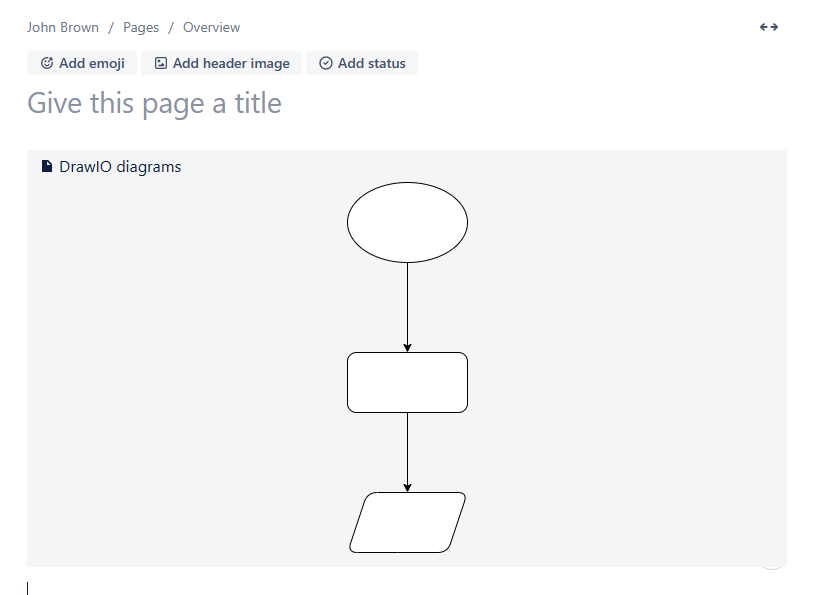

## BPMN Macro

This macro helps you create BPMN diagrams using a built-in version of bpmn.io. The data is securely kept in your Confluence instance and is not shared with bpmn.io.

### Insert BPMN drawings

Select the **BPMN diagrams** macro from the macro list.

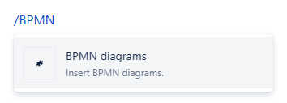

Click **Open Editor**.

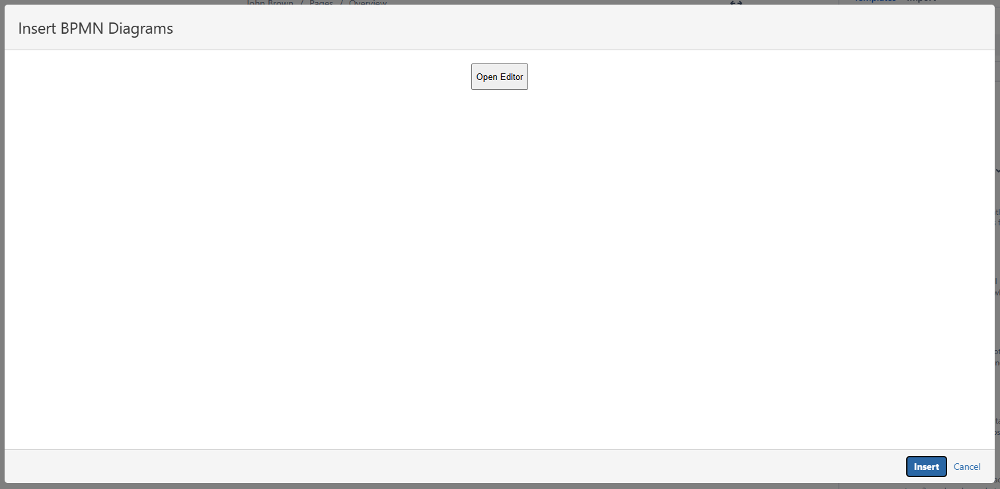

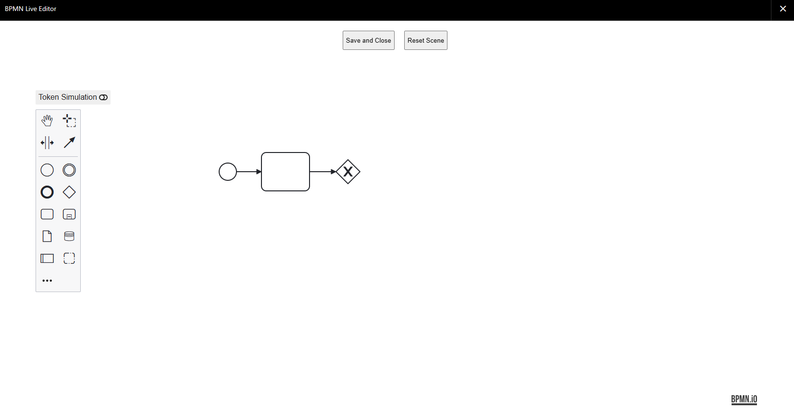

Click **Save and Close**, and wait until the drawing shows up in the dialog. If you don't want to save the changes, click the **X** button on the top right corner.

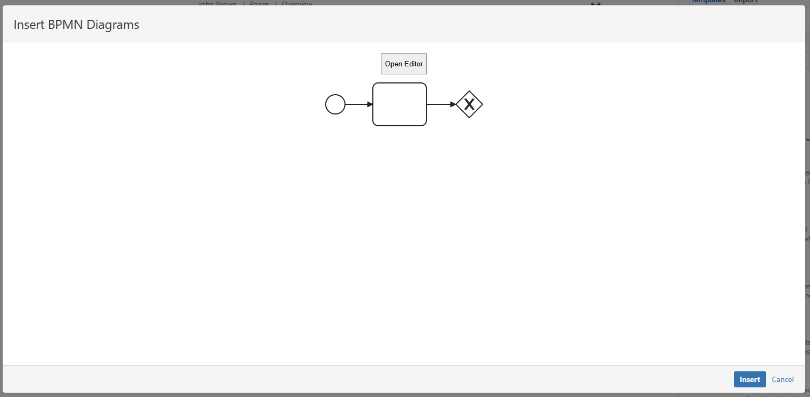

Click **Insert** (for new macro contents) or **Save** (for existing macro content).

## Mermaid UML Diagrams Macro

The **Render Mermaid UML Diagrams** macro (<https://mermaid-js.github.io/mermaid/#/>) uses Mermaid to render UML diagrams. It allows you to define UML diagrams in plain-text format just like Markdown.

For a live editor to draft your diagrams, please try <https://mermaidjs.github.io/mermaid-live-editor>.

In the Confluence editor, open the **Select macro** dialog. The macro name is **Render Mermaid UML Diagrams**.


Alternatively, type / (**slash**) and select the macro.

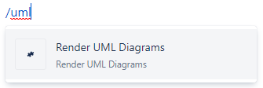

A dialog will appear. Type the content of the UML diagram into the macro editor. Here is an example:

```
sequenceDiagram
    participant Alice
    participant Bob
    Alice->>John: Hello John, how are you?
    loop Healthcheck
        John->>John: Fight against hypochondria
    end
    Note right of John: Rational thoughts <br/>prevail!
    John-->>Alice: Great!
    John->>Bob: How about you?
    Bob-->>John: Jolly good!
```

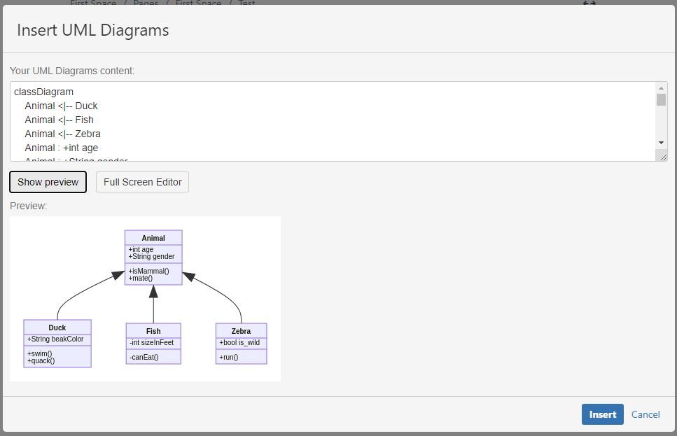

While editing, you can click **Show preview** to see the result. You can also click **Full Screen Editor** to open the Mermaid editor that will help you design new diagrams easily.

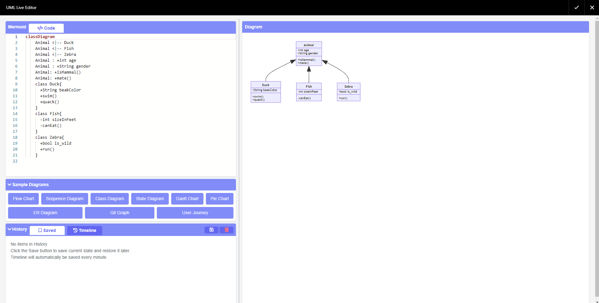

Save the page, and the UML diagram will be rendered.


## PlantUML Diagrams Macro

The **Render PlantUML Diagrams** macro (<https://plantuml.com/>) uses PlantUML to render UML diagrams. It allows you to define UML diagrams in plain-text format just like Markdown.

For a live editor to draft your diagrams, please try <http://www.plantuml.com/plantuml>.

In the Confluence editor, open the **Select macro** dialog. The macro name is **Render PlantUML Diagrams**.


A dialog will appear. Type the content of the UML diagram into the macro editor. Here is an example:

```plant-uml
@startuml C4_Elements
!include https://raw.githubusercontent.com/plantuml-stdlib/C4-PlantUML/master/C4_Container.puml

Person(personAlias, "Label", "Optional Description")
Container(containerAlias, "Label", "Technology", "Optional Description")
System(systemAlias, "Label", "Optional Description")

Rel(personAlias, containerAlias, "Label", "Optional Technology")
@enduml
```

You can find more examples here <https://plantuml.com/>. The PDF guideline can be downloaded here <https://plantuml.com/guide>.

Save the macro, and the UML diagram will be rendered.

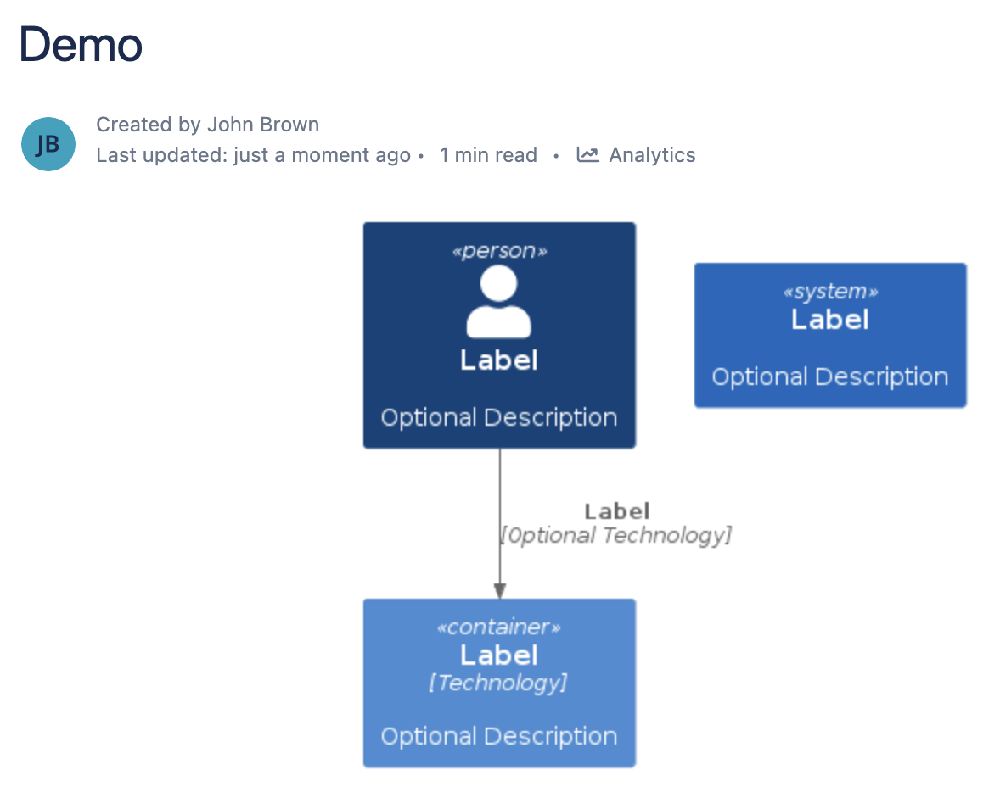

## Graphviz Diagrams Macro

The Graphviz layout programs (<https://www.graphviz.org/>) take descriptions of graphs in a simple text language, and make diagrams in useful formats, such as images and SVG for web pages; PDF or Postscript for inclusion in other documents; or display in an interactive graph browser. Graphviz has many useful features for concrete diagrams, such as options for colors, fonts, tabular node layouts, line styles, hyperlinks, and custom shapes.

You can find more Graphviz examples [here](https://graphs.grevian.org/example).

In the Confluence editor, open the **Select macro** dialog. The macro name is **Render Graphviz Diagrams**.


Select the macro, then click **Insert**.

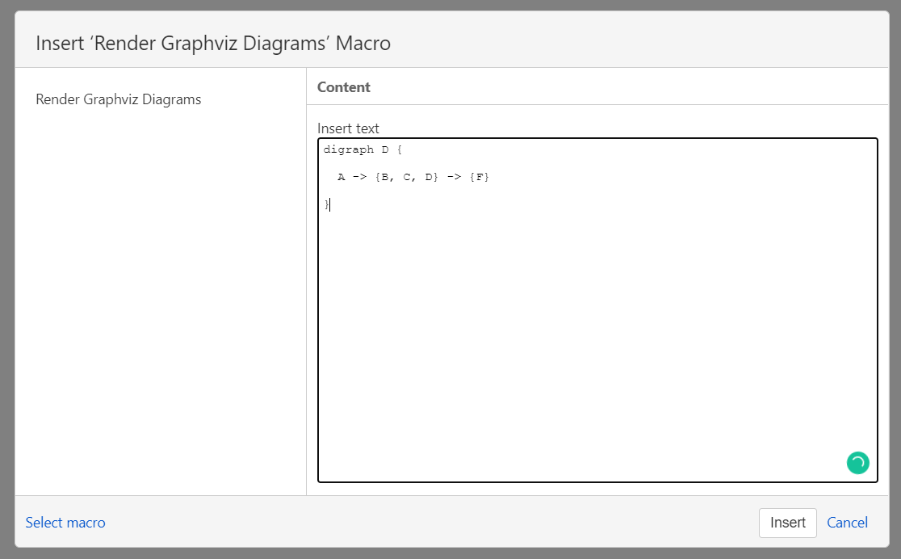

Type the content of the Graphviz diagram into the macro editor. Here is an example:

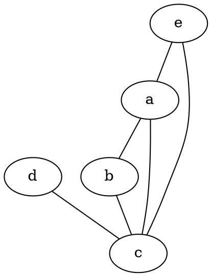
```dot
graph {
  a -- b;
  b -- c;
  a -- c;
  d -- c;
  e -- c;
  e -- a;
}
```


Save the page, and the Graphviz diagram will be rendered.

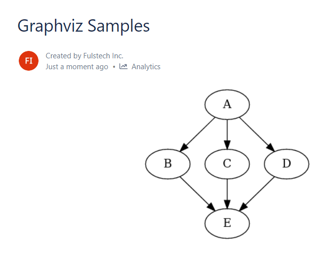

## Mindmap

Select the **Mind Map** macro from the macro list.

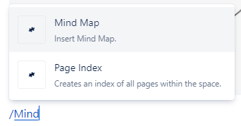

Click **Open Editor**.

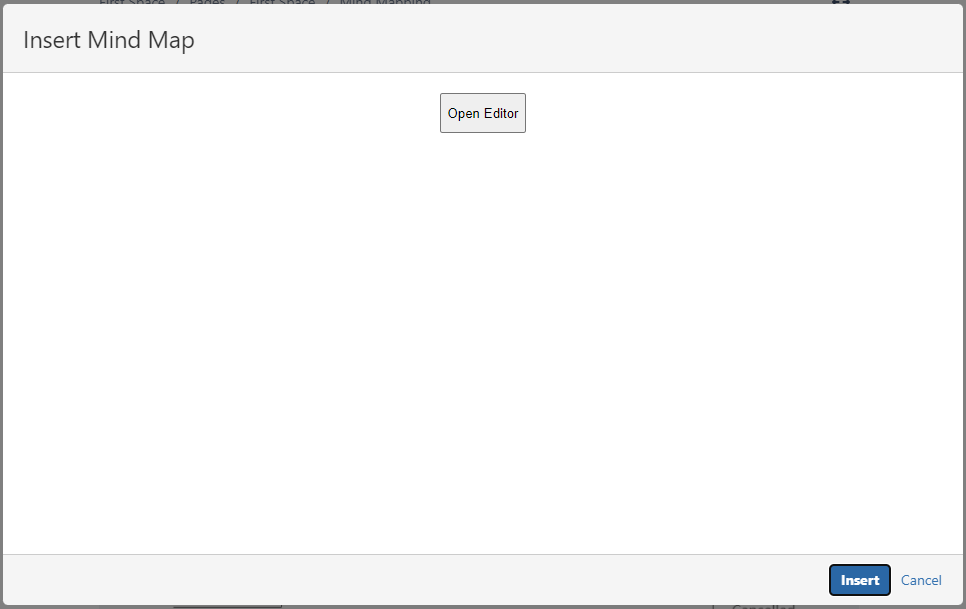

The Mind Map Editor now opens and you can start brainstorming! To create a subtopic, use **Tab.** To create a sibling topic, use **Enter**.

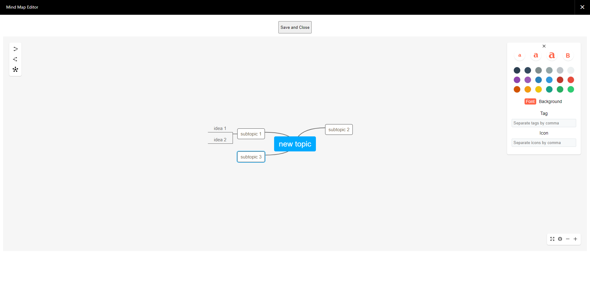

Click **Save and Close**, and wait until the drawing shows up in the dialog. If you don't want to save the changes, click the **X** button on the top right corner.


Click **Insert** (for new macro contents) or **Save** (for existing macro content).


## Examples

### Mermaid

#### Flowchart

Flowcharts can be rendered with Mermaid. See more <https://mermaid-js.github.io/mermaid/#/flowchart>.


#### Sequence diagram

Sequence diagrams can be rendered with Mermaid. See more <https://mermaid-js.github.io/mermaid/#/sequenceDiagram>.


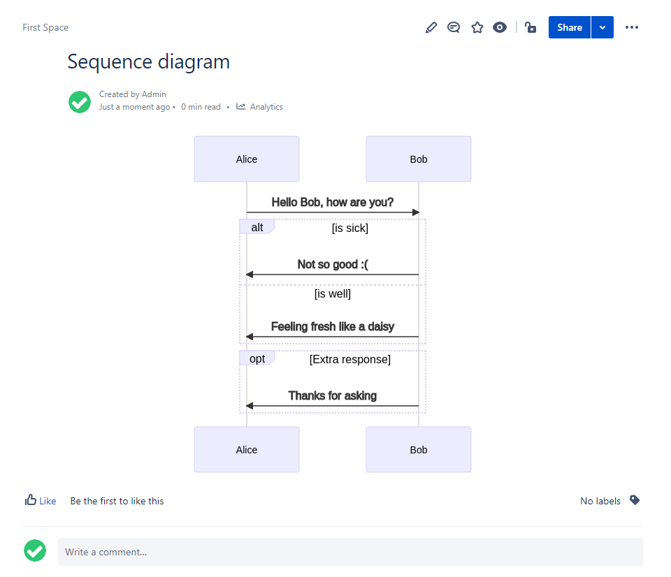

#### Class diagram

Class diagrams can be rendered with Mermaid. See more <https://mermaid-js.github.io/mermaid/#/classDiagram>.

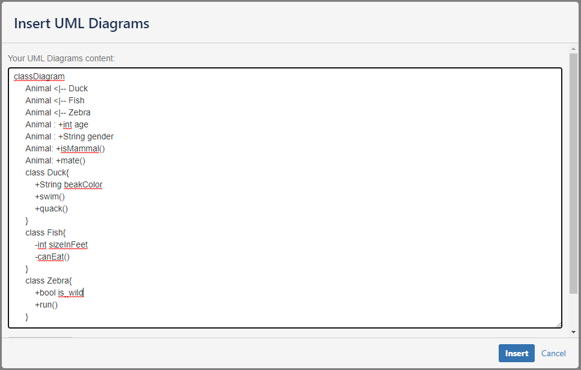


#### State diagram

State diagrams can be rendered with Mermaid. See more <https://mermaid-js.github.io/mermaid/#/stateDiagram>.

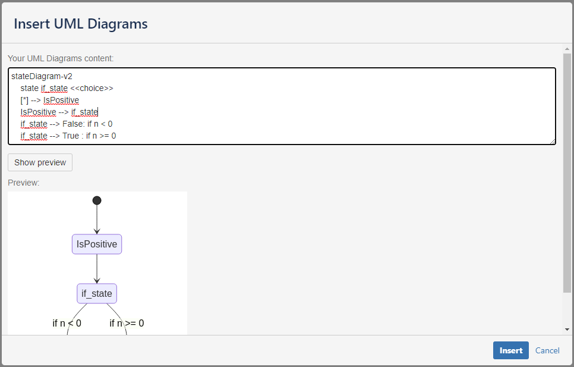

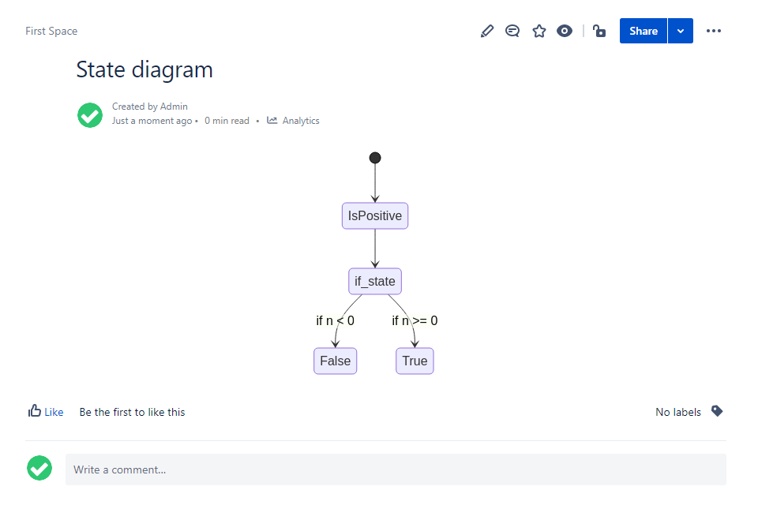

#### Entity Relationship diagram

Entity Relationship diagrams can be rendered with Mermaid. See more <https://mermaid-js.github.io/mermaid/#/entityRelationshipDiagram>.

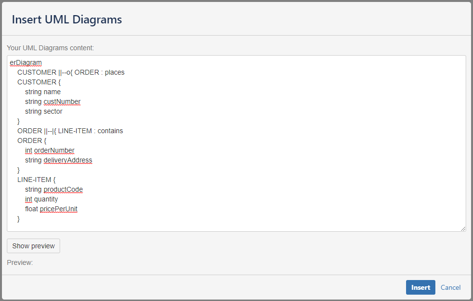


#### User Journey

User Journey can be rendered with Mermaid. See more <https://mermaid-js.github.io/mermaid/#/user-journey>.


#### Gantt chart

Gantt charts can be rendered with Mermaid. See more <https://mermaid-js.github.io/mermaid/#/gantt>.


#### Pie chart

Pie charts can be rendered with Mermaid. See more <https://mermaid-js.github.io/mermaid/#/pie>.

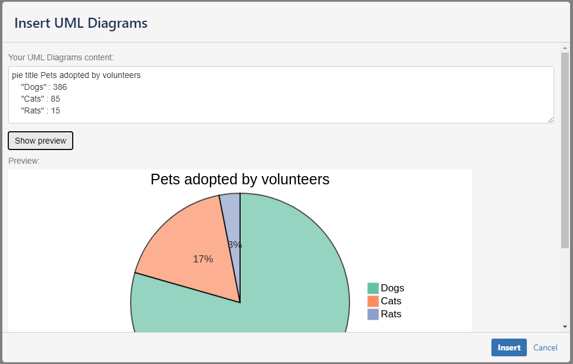


### Graphviz

This diagram is rendered with Graphviz.


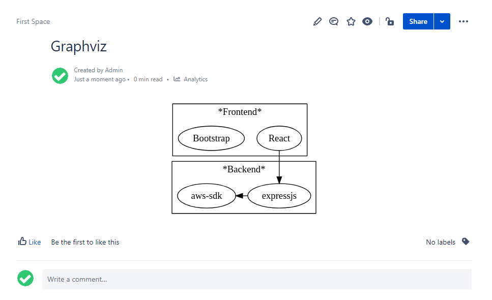

### PlantUML

#### Sequence diagram

```plant-uml
@startuml
Alice -> Bob: Authentication Request
Bob --> Alice: Authentication Response
Alice -> Bob: Another authentication Request
Alice <-- Bob: Another authentication Response
@enduml
```

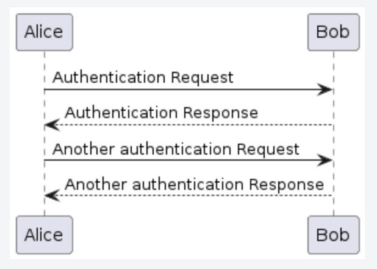

#### Use Case diagram

```plant-uml
@startuml
left to right direction
actor Guest as g
package Professional {
    actor Chef as c
    actor "Food Critic" as fc
}
package Restaurant {
    usecase "Eat Food" as UC1
    usecase "Pay for Food" as UC2
    usecase "Drink" as UC3
    usecase "Review" as UC4
}
fc --> UC4
g --> UC1
g --> UC2
g --> UC3
@enduml
```

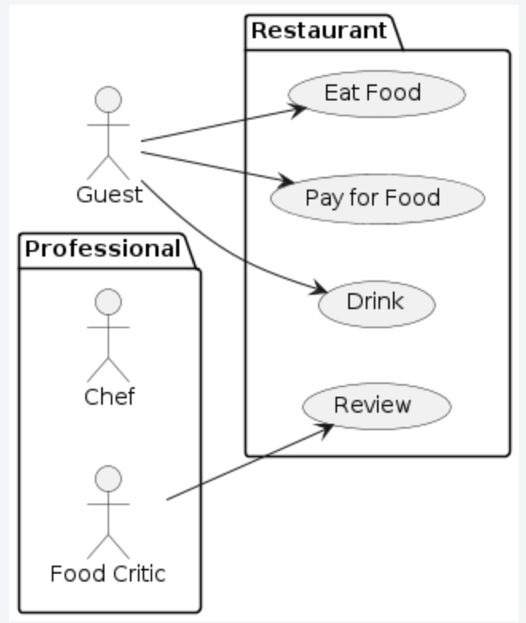

#### Class diagram

```plant-uml
@startuml
Object <|-- ArrayList
Object : equals()
ArrayList : Object[] elementData
ArrayList : size()
@enduml
```

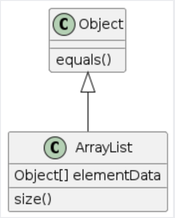

#### Activity diagram

```plant-uml
@startuml
start
repeat
    :read data;
    :generate diagrams;
repeat while (more data?) is (yes)
->no;
stop
@enduml
```

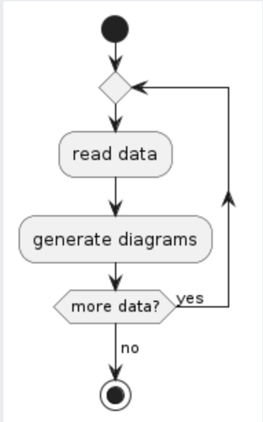

#### Component diagram

```plant-uml
@startuml
package "Some Group" {
  HTTP - [First Component]
  [Another Component]
}
node "Other Groups" {
  FTP - [Second Component]
  [First Component] --> FTP
}
cloud {
  [Example 1]
}
database "MySql" {
  folder "This is my folder" {
    [Folder 3]
  }
  frame "Foo" {
    [Frame 4]
  }
}
[Another Component] --> [Example 1]
[Example 1] --> [Folder 3]
[Folder 3] --> [Frame 4]
@enduml
```

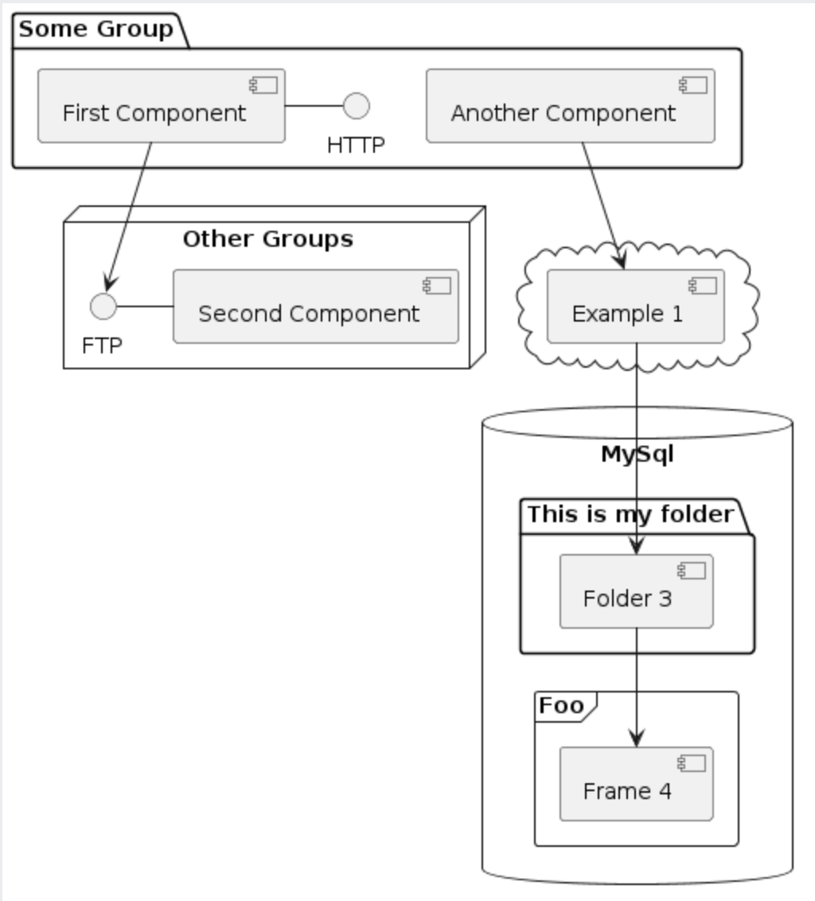

#### Deployment diagram

```plant-uml
@startuml
node node1
node node2
node node3
node node4
node node5
node1 -- node2 : label1
node1 .. node3 : label2
node1 ~~ node4 : label3
node1 == node5
@enduml
```

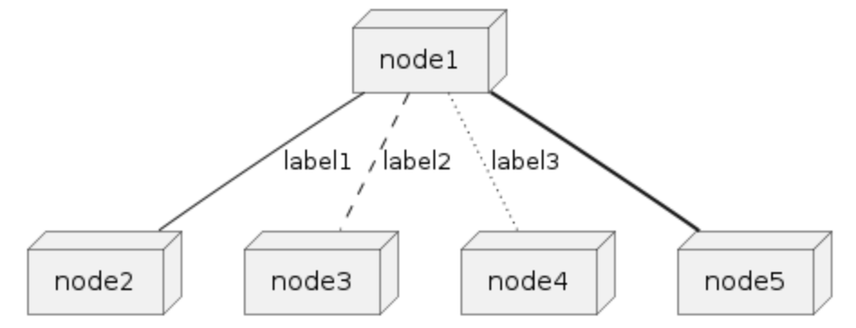

#### State diagram

```plant-uml
@startuml
scale 350 width
[*] --> NotShooting
state NotShooting {
  [*] --> Idle
  Idle --> Configuring : EvConfig
  Configuring --> Idle : EvConfig
}
state Configuring {
  [*] --> NewValueSelection
  NewValueSelection --> NewValuePreview : EvNewValue
  NewValuePreview --> NewValueSelection : EvNewValueRejected
  NewValuePreview --> NewValueSelection : EvNewValueSaved
  state NewValuePreview {
    State1 -> State2
  }
}
@enduml
```

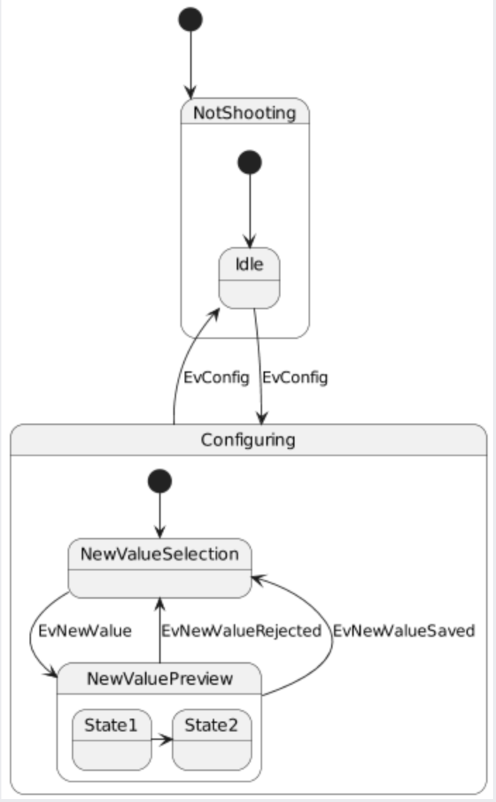

#### Timing diagram

```plant-uml
@startuml
robust "Web Browser" as WB
concise "Web User" as WU
@0
WU is Idle
WB is Idle
@100
WU is Waiting
WB is Processing
@300
WB is Waiting
@enduml
```

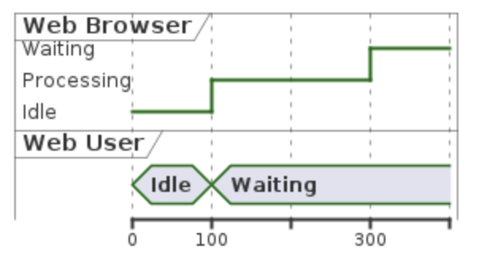

#### JSON

```plant-uml
@startjson
{
  "firstName": "John",
  "lastName": "Smith",
  "isAlive": true,
  "age": 27,
  "address": {
    "streetAddress": "21 2nd Street",
    "city": "New York",
    "state": "NY",
    "postalCode": "10021-3100"
  },
  "phoneNumbers": [
    {
      "type": "home",
      "number": "212 555-1234"
    },
    {
      "type": "office",
      "number": "646 555-4567"
    }
  ],
  "children": [],
  "spouse": null
}
@endjson
```

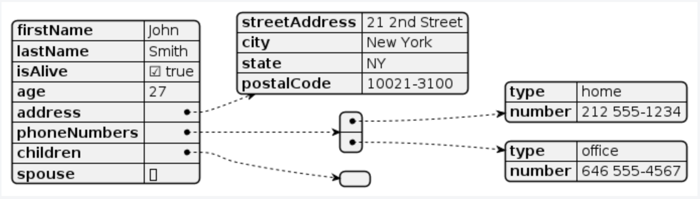

#### Mindmap

```plant-uml
@startmindmap
* Class Templates
**:Example 1
<code>
template <typename T>
class cname{
void f1()<U+003B>
...
}
</code>
;
**:Example 2
<code>
other template <typename T>
class cname{
...
</code>
;
@endmindmap
```

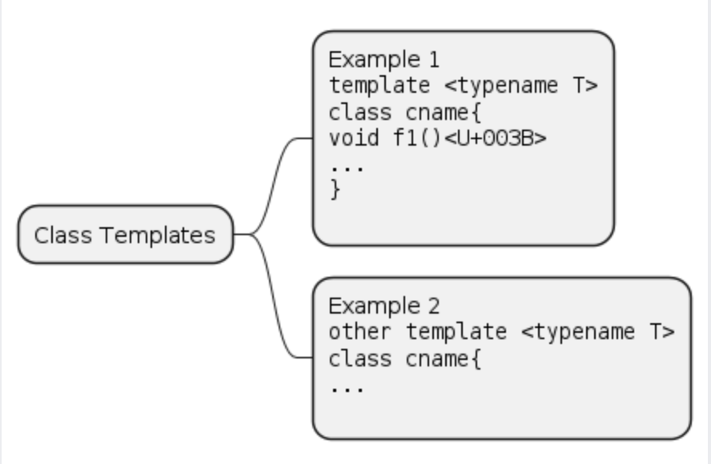

#### Work Breakdown Structure

```plant-uml
@startwbs
* Business Process Modelling WBS
** Launch the project
*** Complete Stakeholder Research
*** Initial Implementation Plan
** Design phase
*** Model of AsIs Processes Completed
**** Model of AsIs Processes Completed1
**** Model of AsIs Processes Completed2
*** Measure AsIs performance metrics
*** Identify Quick Wins
** Complete innovate phase
@endwbs
```

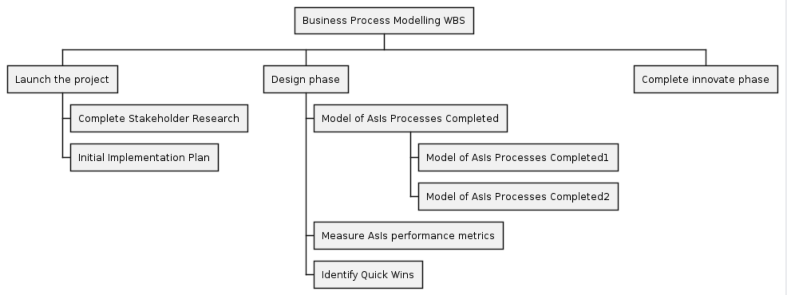

#### Maths

```plant-uml
@startuml
:<math>int_0^1f(x)dx</math>;
:<math>x^2+y_1+z_12^34</math>;
note right
Try also
<math>d/dxf(x)=lim_(h->0)(f(x+h)-f(x))/h</math>
<latex>P(y|\mathbf{x}) \mbox{ or } f(\mathbf{x})+\epsilon</latex>
end note
@enduml
```

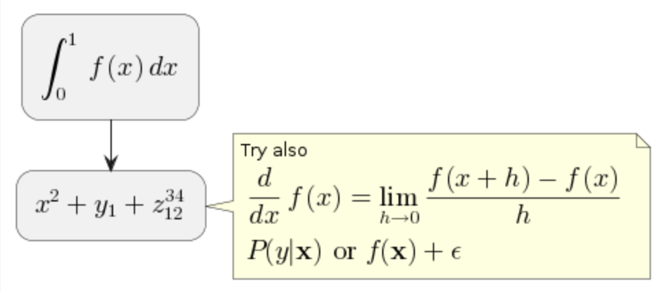

#### Entity Relationship diagram

```plant-uml
@startuml
' hide the spot
hide circle
' avoid problems with angled crows feet
skinparam linetype ortho
entity "Entity01" as e01 {
  *e1_id : number <<generated>>
  --
  *name : text
  description : text
}
entity "Entity02" as e02 {
  *e2_id : number <<generated>>
  --
  *e1_id : number <<FK>>
  other_details : text
}
entity "Entity03" as e03 {
  *e3_id : number <<generated>>
  --
  e1_id : number <<FK>>
  other_details : text
}
e01 ||..o{ e02
e01 |o..o{ e03
@enduml
```

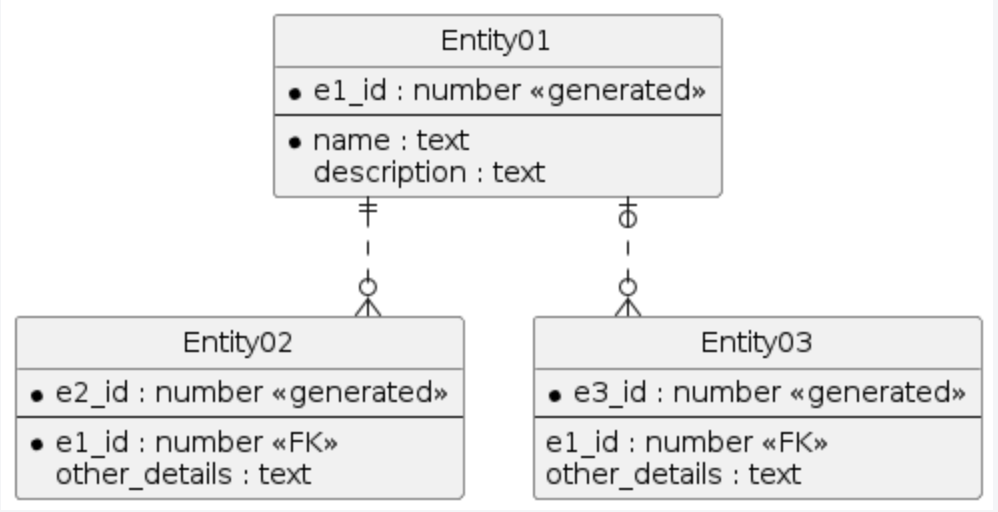

#### C4 diagram

```plant-uml
@startuml
!include https://raw.githubusercontent.com/plantuml-stdlib/C4-PlantUML/master/C4_Container.puml
' uncomment the following line and comment the first to use locally
' !include C4_Container.puml

' LAYOUT_TOP_DOWN()
' LAYOUT_AS_SKETCH()
LAYOUT_WITH_LEGEND()

title Container diagram for Internet Banking System

Person(customer, Customer, "A customer of the bank, with personal bank accounts")

System_Boundary(c1, "Internet Banking") {
    Container(web_app, "Web Application", "Java, Spring MVC", "Delivers the static content and the Internet banking SPA")
    Container(spa, "Single-Page App", "JavaScript, Angular", "Provides all the Internet banking functionality to cutomers via their web browser")
    Container(mobile_app, "Mobile App", "C#, Xamarin", "Provides a limited subset of the Internet banking functionality to customers via their mobile device")
    ContainerDb(database, "Database", "SQL Database", "Stores user registration information, hashed auth credentials, access logs, etc.")
    Container(backend_api, "API Application", "Java, Docker Container", "Provides Internet banking functionality via API")
}

System_Ext(email_system, "E-Mail System", "The internal Microsoft Exchange system")
System_Ext(banking_system, "Mainframe Banking System", "Stores all of the core banking information about customers, accounts, transactions, etc.")

Rel(customer, web_app, "Uses", "HTTPS")
Rel(customer, spa, "Uses", "HTTPS")
Rel(customer, mobile_app, "Uses")

Rel_Neighbor(web_app, spa, "Delivers")
Rel(spa, backend_api, "Uses", "async, JSON/HTTPS")
Rel(mobile_app, backend_api, "Uses", "async, JSON/HTTPS")
Rel_Back_Neighbor(database, backend_api, "Reads from and writes to", "sync, JDBC")

Rel_Back(customer, email_system, "Sends e-mails to")
Rel_Back(email_system, backend_api, "Sends e-mails using", "sync, SMTP")
Rel_Neighbor(backend_api, banking_system, "Uses", "sync/async, XML/HTTPS")
@endumlplan
```

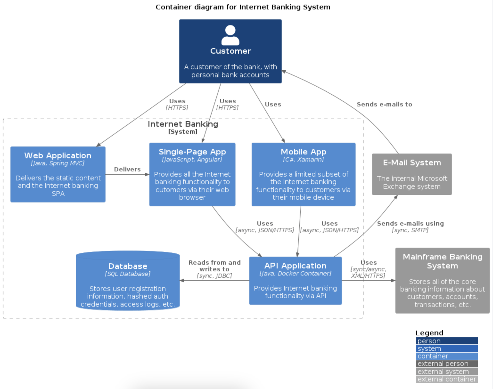

#### AWS architecture diagram

```plant-uml
@startuml S3 Upload Workflow
'Copyright 2019 Amazon.com, Inc. or its affiliates. All Rights Reserved.
'SPDX-License-Identifier: MIT (For details, see https://github.com/awslabs/aws-icons-for-plantuml/blob/master/LICENSE)

!define AWSPuml https://raw.githubusercontent.com/awslabs/aws-icons-for-plantuml/v15.0/dist
!include AWSPuml/AWSCommon.puml
!include AWSPuml/AWSExperimental.puml
!include AWSPuml/Groups/all.puml
!include AWSPuml/Compute/LambdaLambdaFunction.puml
!include AWSPuml/General/Documents.puml
!include AWSPuml/General/Multimedia.puml
!include AWSPuml/General/Tapestorage.puml
!include AWSPuml/General/User.puml
!include AWSPuml/MediaServices/ElementalMediaConvert.puml
!include AWSPuml/MachineLearning/Transcribe.puml
!include AWSPuml/Storage/SimpleStorageService.puml

' define custom group for Amazon S3 bucket
AWSGroupColoring(S3BucketGroup, #FFFFFF, AWS_COLOR_GREEN, plain)
!define S3BucketGroup(g_alias, g_label="Amazon S3 bucket") AWSGroupEntity(g_alias, g_label, AWS_COLOR_GREEN, SimpleStorageService, S3BucketGroup)

' Groups are rectangles with a custom style using stereotype - need to hide
hide stereotype
skinparam linetype ortho
skinparam rectangle {
    BackgroundColor AWS_BG_COLOR
    BorderColor transparent
}

rectangle "$UserIMG()\nUser" as user
AWSCloudGroup(cloud){
  RegionGroup(region) {
    S3BucketGroup(s3) {
      rectangle "$MultimediaIMG()\n\tvideo\t" as video
      rectangle "$TapestorageIMG()\n\taudio\t" as audio
      rectangle "$DocumentsIMG()\n\ttranscript\t" as transcript

      user -r-> video: <$Callout_1>\lupload
      video -r-> audio
      audio -r-> transcript
    }

    rectangle "$LambdaLambdaFunctionIMG()\nObjectCreated\nevent handler" as e1
    rectangle "$ElementalMediaConvertIMG()\nAWS Elemental\nMediaConvert" as mediaconvert
    rectangle "$TranscribeIMG()\nAmazon Transcribe\n" as transcribe

    video -d-> e1: <$Callout_2>
    e1 -[hidden]r-> mediaconvert
    mediaconvert -[hidden]r-> transcribe
    mediaconvert -u-> audio: <$Callout_3>
    transcribe -u-> transcript: <$Callout_4>

    StepFunctionsWorkflowGroup(sfw) {
      rectangle "$LambdaLambdaFunctionIMG()\nextract audio" as sfw1
      rectangle "$LambdaLambdaFunctionIMG()\ntranscribe audio" as sfw2

      e1 -r-> sfw1: Start\nExecution
      sfw1 -r-> sfw2
      sfw1 -u-> mediaconvert
      sfw2 -u-> transcribe
    }
  }
}

@enduml
```

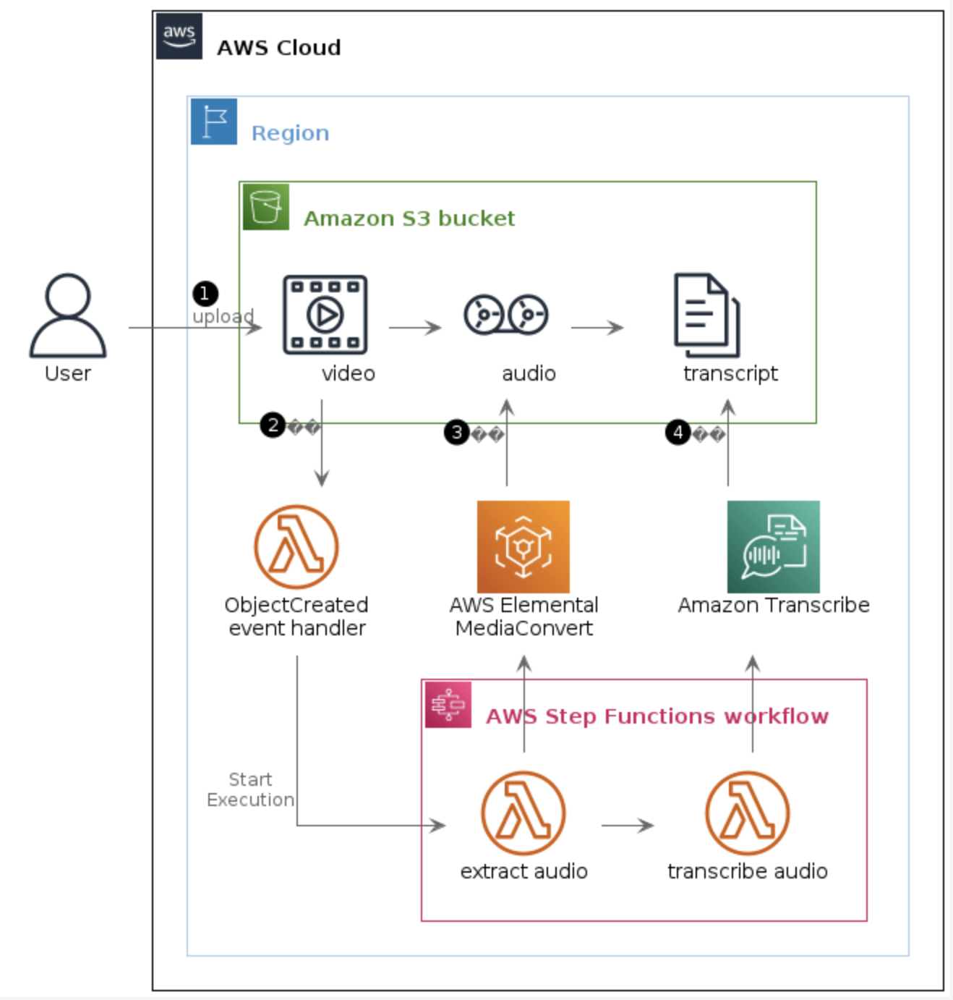
