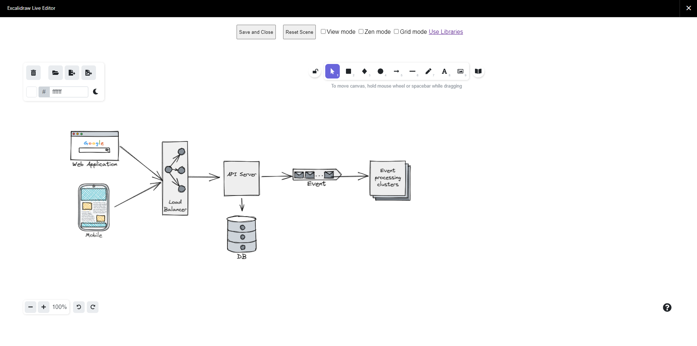

**Excalidraw for Confluence** helps you easily brainstorm & visualize ideas, with UML diagrams, GUI wireframes, and many things else.

Macros included:

* Excalidraw: whiteboard and drawing tool for UML diagrams, GUI wireframes, or anything you want.
* Mermaid, PlantUML, Graphviz: draw UML diagrams, software architecture design using Markdown-like plaintext format.

The version for Confluence Data Center and Confluence Server is waiting for Atlassian's approval.

