## Configuration

Enable the **Excalidraw** panel on the issue page.

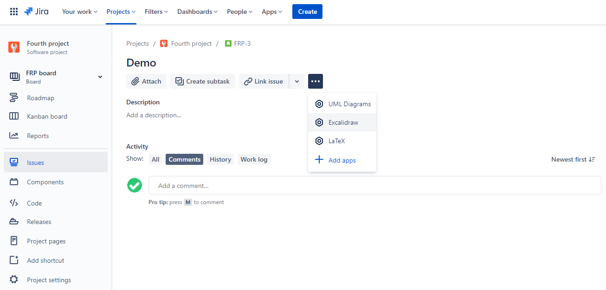

## Create a new drawing

Click **Add New Drawing**.

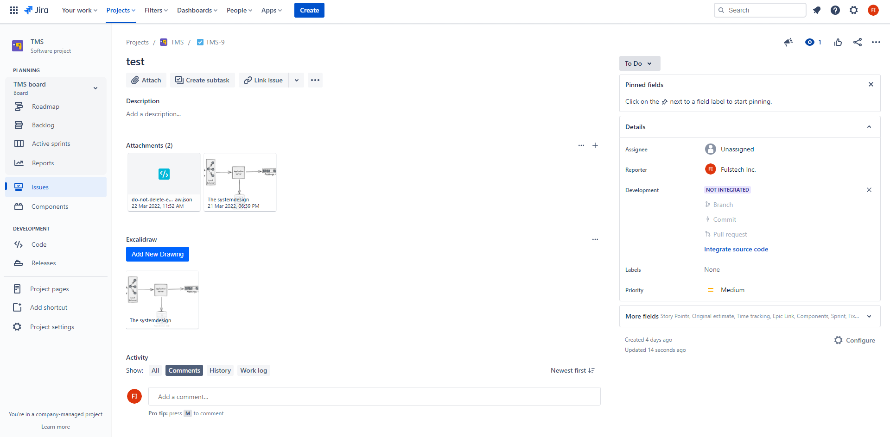

Provide **Drawing name**, and draw some diagrams.

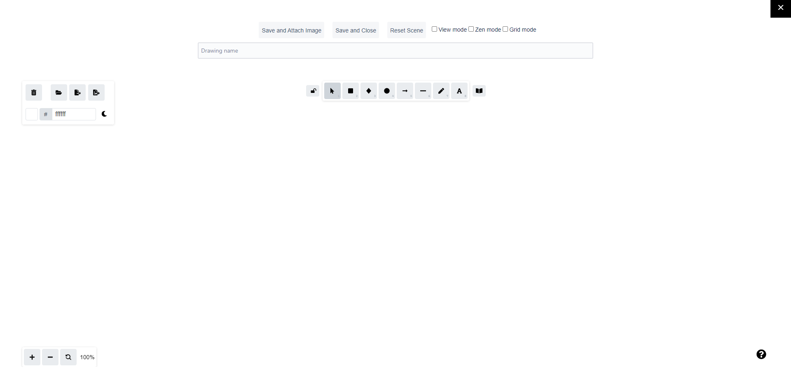

Draw anything you want. To draw perfect shapes like a circle, hold the **Shift** button while drawing.

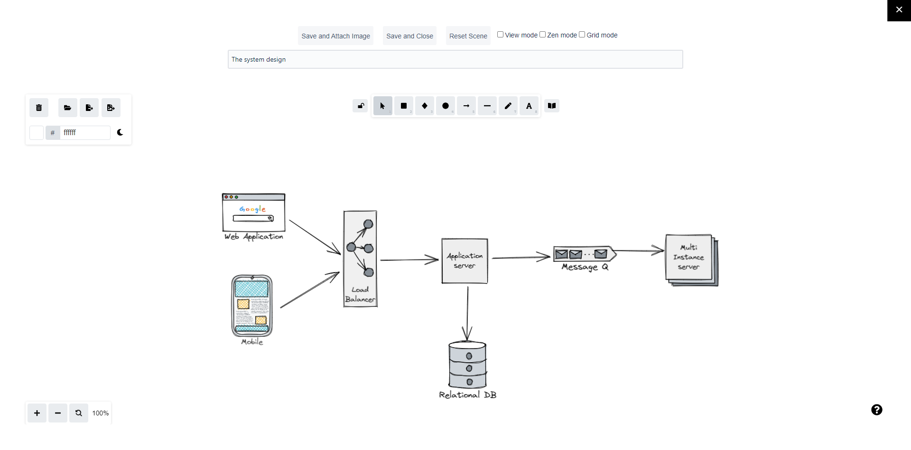

Click **Save and Close** to save the drawing and go back to the issue.

The drawings are stored as an attachment named `do-not-delete-excalidraw.json`. This file should not be deleted or modified manually.&#x20;

If you also want to export the drawing as an issue attachment, click **Save and Attach Image**. If the attachment does not appear, please refresh the issue page.

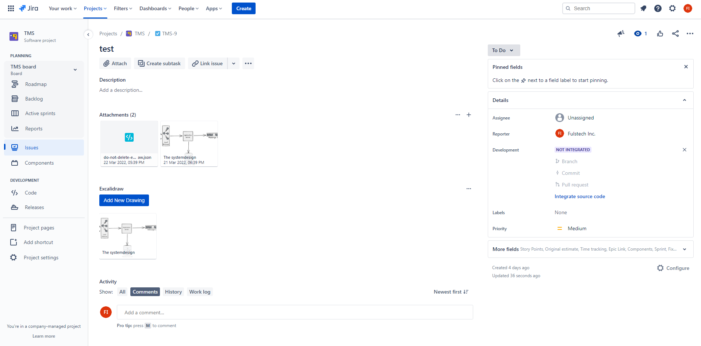

## Edit an existing drawing

To edit, click the thumbnail in the **Excalidraw** panel. Find the **Edit** button in the menu.

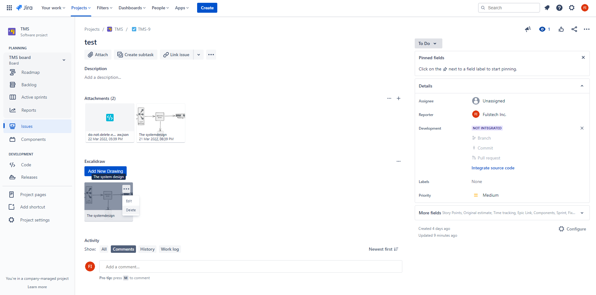

## Delete an existing drawing

Find the **Delete** button in the menu. At this moment the deletion is permanent.

## Adding new shapes from the Excalidraw Libraries website

The Excalidraw Libraries website (<https://libraries.excalidraw.com>) provides a lot of useful shapes. These shapes are contributed by the community.

To add new shapes, visit the website and click the **Download** button to save the collection you need to your computer. The downloaded library file's extension is `.excalidrawlib`.

> **Do not use the Add to Excalidraw button, as the library will not be added to the plugin-hosted Excalidraw Editor.**

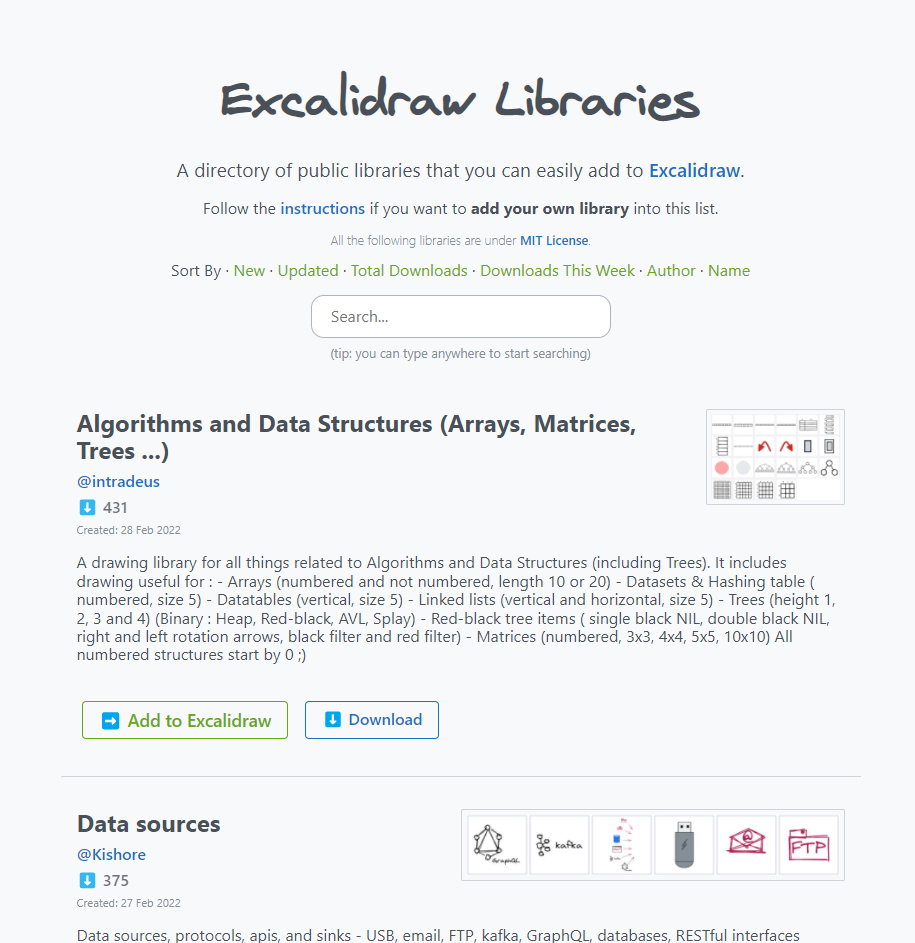

Open the Excalidraw Editor in Jira, and upload the library file.

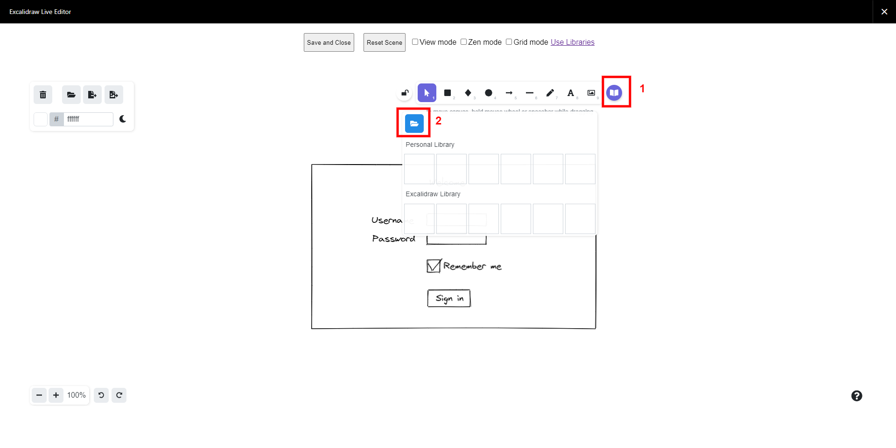

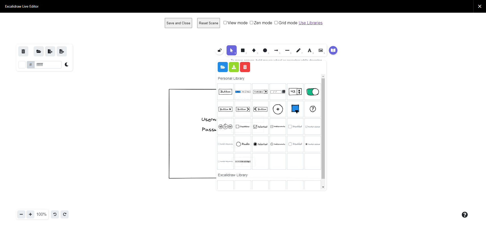

You can then drag and drop shapes into the canvas.

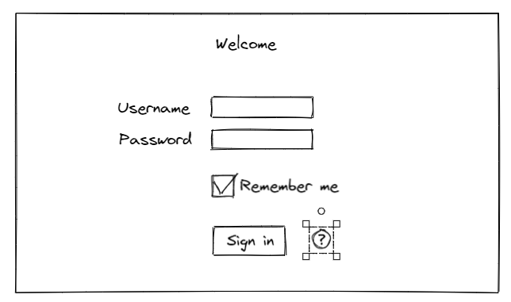

## Saving shapes as libraries

Let's say we want to save the following doughnut shape to reuse later. The first step is to select the whole shape.

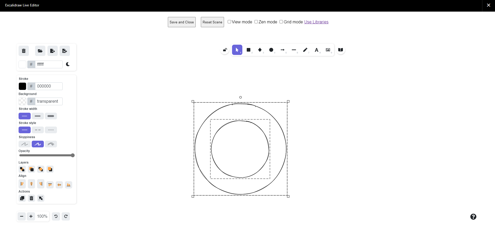

Add the selected shape to your library.

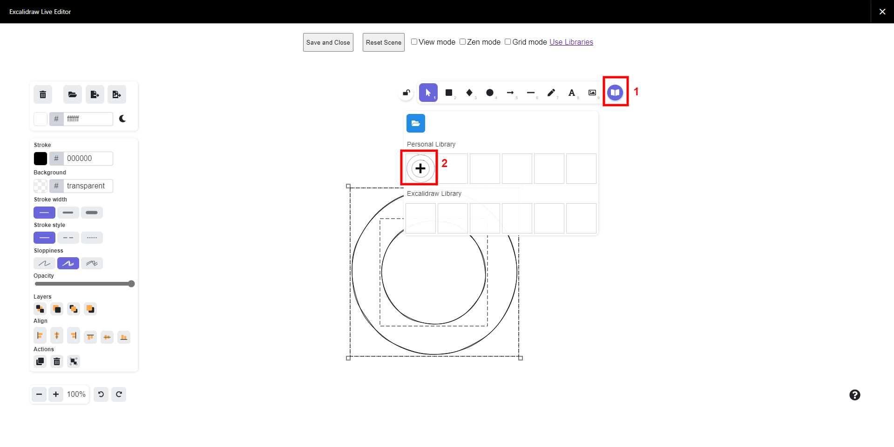

To save your library locally (for the backup purpose, for example), click the **Export** button.

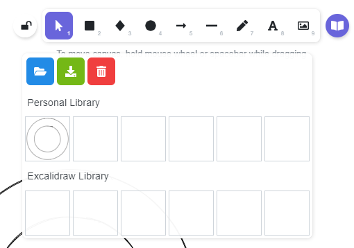
