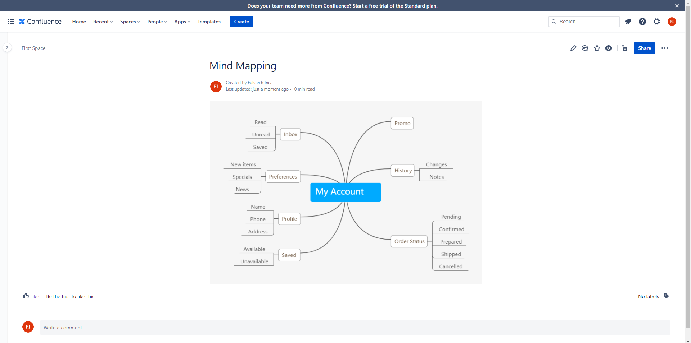

**Mind Mapping for Confluence** provides a macro for creating Mind Maps in Confluence articles. Mind Mapping is a powerful tool for brainstorming, exploring, and expressing ideas in a connected way.

You can install the app by following the instructions at [Atlassian Marketplace](https://marketplace.atlassian.com/apps/1227802/mind-mapping-for-confluence?tab=installation\&hosting=cloud).

