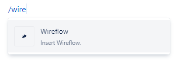
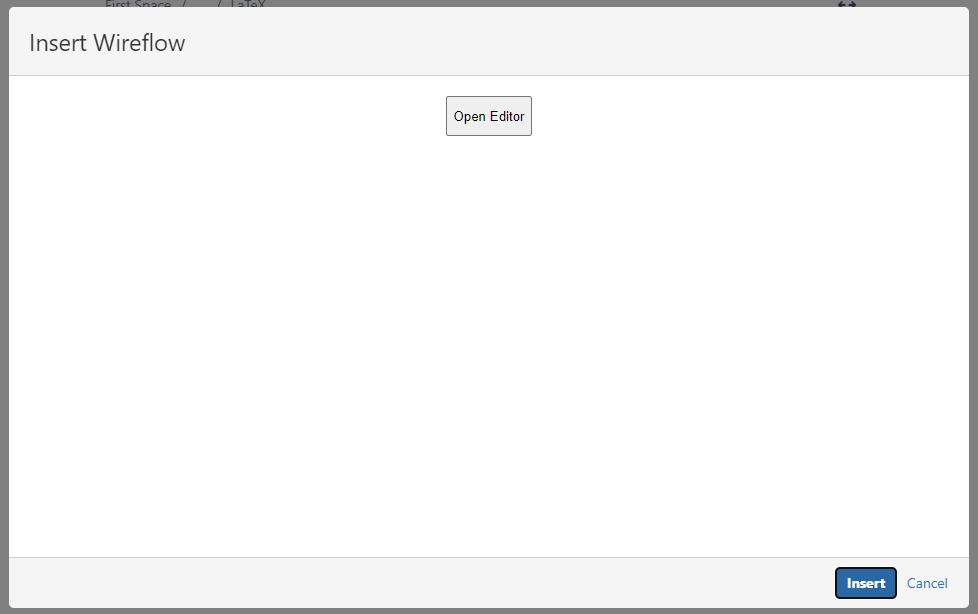
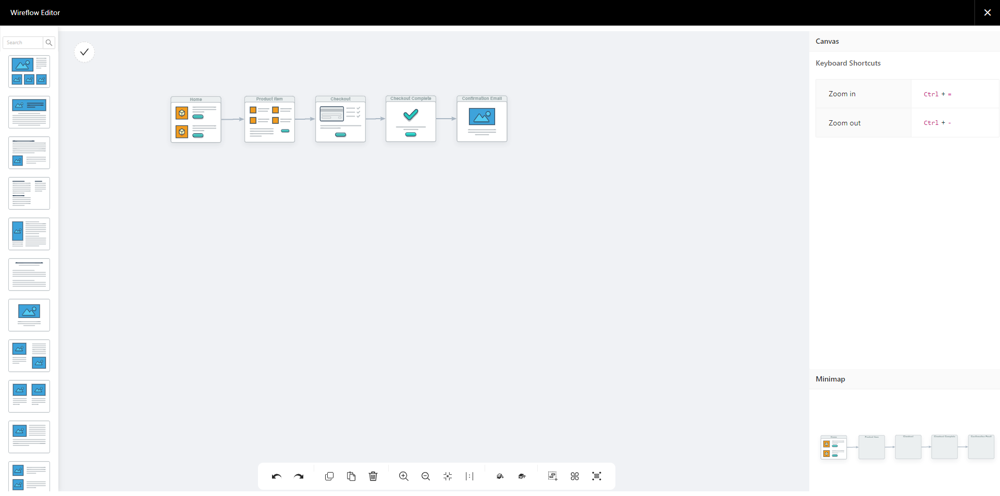
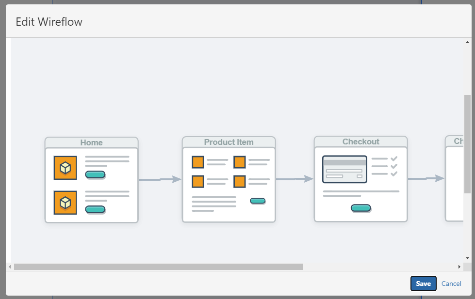
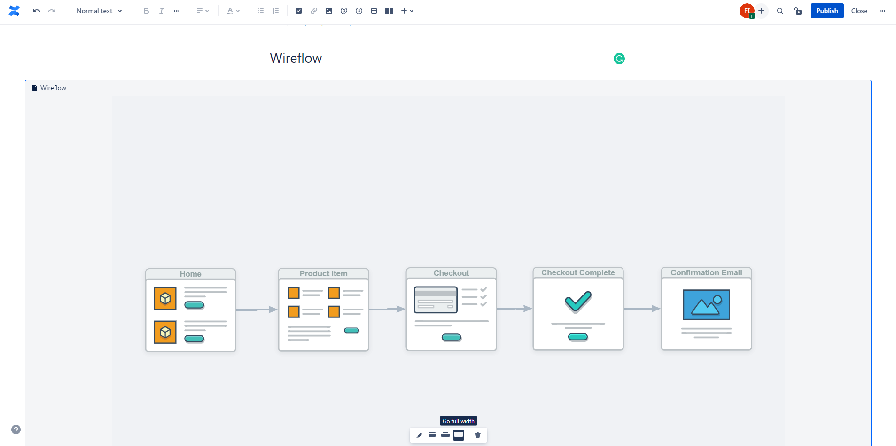

Select the **Insert Wireflow** macro from the macro list.

Click **Open Editor**.

Search and drag the screens into the canvas. To rename a screen, select it and input the new name in the **Node** panel.

To create a connection between screens, drag and drop the head anchor on the tail anchor. You can also click on the line to change its style.

Click the **Check** button on the top left corner, and wait until the drawing shows up in the dialog. If you don't want to save the changes, click the **X** button on the top right corner.

Click **Insert**.

